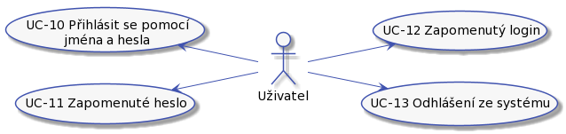
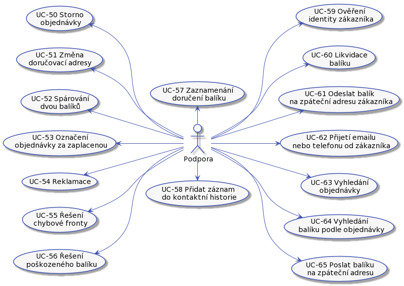

# Analýza
## Role

Mame tyto role:

### Uživatel

Predstavuje nekoho, kdo ma pristup do systemu. Podle jeho dalsi specializace ma dalsi moznosti.

Uzivatel muze:

* UC-00 - [Přihlásit se pomocí jména a hesla](../uc-00/#uc-00 "Přihlásit se pomocí jména a hesla").
* UC-01 - Zapomenute heslo.
* UC-02 - Zapomenuty login.
* UC-03 - [Odhlášeni ze systému](../uc-00/#uc-03 "Odhlášeni ze systému").

UC-01 a UC-02 ted nebudem resit, stejně tak s tím spojené UC.

### Zákazník

Zákazník naší doručovací služby. Může to být fyzická osoba nebo společnost.

Zákaznik můze:

* UC-04 [Registrovat balik](../uc-04/)
* UC-05 Dorucit balik do depa. Pouze zakaznikovi nabidnem moznost poslat libovolnou postou nebo fyzicky prinest na sberne misto.
* UC-06 [Sledovaní balíku](../uc-06/ "Sledovaní balíku"). Zákazník musí mít možnost sledovat zásilku. Kde je a co se s ni deje.
* UC-07 Zaplatit za doručeni. Posledni krok UC-04.

**TODO negativni scenare**

### Admin

Pracovnik dorucovaci sluzby, ktery dohlizi na fungovani systemu.

UC admina nebudem v první fázi řešit.

**TODO aspon si v bodech sepsat,co by tu mělo být**

### Dispečer

Dispečet je pracovnik doručovací sluzby, odpovědný za činnosti s balíkem od převzetí balíku od dopravce až po předání dalšímu dopravci.

Dispecer musí být v depu. Depo bude umístěné tak, aby bylo v dobrém dosahu přepravců. Co dispečer dělá:

* UC-20 - [Přijetí balíku](../uc-20/#UC-20 "Přijetí balíku").
* UC-21 - [Zpracování přijatých balíků](../uc-20/#UC-21 "Zpracování přijatých balíků").
* UC-22 - [Zpracování balíků v 'čekací frontě'](../uc-20/#UC-22 "Zpracování balíků v 'čekací frontě'").
* UC-23 - [Zpracování balíků 'k doručení'](../uc-20/#UC-23 "Zpracování balíků 'k doručení'").
* UC-24 - [Zpracování balíků v 'chybové' frontě](../uc-20/#UC-24 "Zpracování balíků v 'chybové' frontě").
* UC-25 - [Předání balíků dopravci](../uc-20/#UC-25 "Předání balíků dopravci").

### Pracovník podpory

Pracovník naší doručovací služby. Vyřizuje reklamace, nespárované balíky a pomáhá s procesem doručení balíku.

Support může být fyzicky na centrále. Pracovník podpory je odpovědný za:

* UC-31 - [Změna/obnova hesla](../uc-30/#UC-31 "Změna/obnova hesla")
* UC-32 - [Zapomenuté přihlašovací jméno](../uc-30/#UC-32 "Zapomenuté přihlašovací jméno")
* UC-33 - [Kontrola bankovního účtu](../uc-30/#UC-33 "Kontrola bankovního účtu").
* UC-34 - [Párování plateb](../uc-30/#UC-34 "Párování plateb"). 
* UC-35 - [Řešení chybové fronty](../uc-30/#UC-35 "Řešení chybové fronty"). 
* UC-36 - [Storno objednávky](../uc-30/#UC-36 "Storno objednávky"). 
* UC-37 - [Urgence zaplacení](../uc-30/#UC-37 "Urgence zaplacení"). 
* UC-38 - [Řešení přeplacených objednávek](../uc-30/#UC-38 "Řešení přeplacených objednávek").
* UC-39 - [Zobrazení detailů objednávky a balíku](../uc-30/#UC-34 "Zobrazení detailů objednávky a balíku").
* UC-40 - [Vystaveni dobropisu](../uc-30/#UC-34 "Vystaveni dobropisu").
* UC-41 - [TBD](../uc-30/#UC-41 "Urgovani zaplacení").
* UC-42 - [Reklamace](../uc-30/#UC-34 "v").

**Doplnit k UC přechody mezi stavy.**

### eShop

Zákazník, který má možnost zadávát hromadná posílaní balíků.

 
Zákazním může:

* UC-60 - Hromadná registrace balíků

