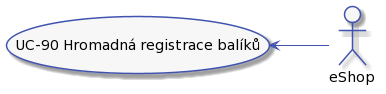

# Analýza
## Role

Máme tyto role:

### Zákazník

Zákazník naší doručovací služby. Může to být fyzická osoba nebo společnost.

Zákaznik můze:

* UC-04 [Registrovat balik](../uc-00/#uc-04).
* UC-05 [Doručit balík do depa](../uc-00/#uc-05).
* UC-06 [Sledovaní balíku](../uc-00/#uc-06).
* UC-07 [Zaplatit za doručeni](../uc-00/#uc-07).

### Uživatel

Představuje někoho, kdo má přístup do systému. Podle jeho dalši specializace má další možnosti.

Uživatel můze:

* UC-10 - [Přihlásit se pomocí jména a hesla](../uc-10/#uc-10).
* UC-11 - [Zapomenuté heslo](../uc-10/#uc-11).
* UC-12 - [Zapomenutý login](../uc-10/#uc-12).
* UC-13 - [Odhlášeni ze systému](../uc-10/#uc-13).

### Dispečer

Dispečer je pracovník doručovací služby, odpovědný za činnosti s balíkem od převzetí balíku od dopravce až po předání dalšímu dopravci.

Dispečer je v depu. Depo bude umístěné tak, aby bylo v dobrém dosahu dopravců. Co dispečer dělá:

* UC-20 - [Přijetí balíku](../uc-20/#UC-20 "Přijetí balíku").
* UC-21 - [Zpracování přijatých balíků](../uc-20/#UC-21 "Zpracování přijatých balíků").
* UC-22 - [Zpracování balíků v 'čekací frontě'](../uc-20/#UC-22 "Zpracování balíků v 'čekací frontě'").
* UC-23 - [Zpracování balíků 'k doručení'](../uc-20/#UC-23 "Zpracování balíků 'k doručení'").
* UC-24 - [Zpracování balíků v 'chybové' frontě](../uc-20/#UC-24 "Zpracování balíků v 'chybové' frontě").
* UC-25 - [Předání balíků dopravci](../uc-20/#UC-25 "Předání balíků dopravci").

### Pracovník podpory

Pracovník naší doručovací služby. Vyřizuje reklamace, nespárované balíky a pomáhá s procesem doručení balíku.

Support může být fyzicky na centrále. Pracovník podpory je odpovědný za:

#### Správa uživatelů

* UC-31 - [Filtrování uživatelů](../uc-30/#UC-31)
* UC-32 - [Změna/obnova hesla](../uc-30/#UC-32)
* UC-33 - [Zapomenuté přihlašovací jméno](../uc-30/#UC-33)
* UC-34 - [Přidat uživatele](../uc-30/#UC-34)
* UC-35 - [Zablokovat uživatele](../uc-30/#UC-35)
* UC-36 - [Upravit uživatele](../uc-30/#UC-36)

#### Správa objednávek a balíků

* UC-40 - [Kontrola bankovního účtu](../uc-40/#UC-40 "Kontrola bankovního účtu").
* UC-41 - [Párování plateb](../uc-40/#UC-41 "Párování plateb").
* UC-42 - [Řešení chybové fronty](../uc-40/#UC-42 "Řešení chybové fronty").
* UC-43 - [Storno objednávky](../uc-40/#UC-43 "Storno objednávky").
* UC-44 - [Urgence zaplacení](../uc-40/#UC-44 "Urgence zaplacení").
* UC-45 - [Řešení přeplacených objednávek](../uc-40/#UC-45 "Řešení přeplacených objednávek").
* UC-46 - [Zobrazení detailů objednávky a balíku](../uc-40/#UC-46 "Zobrazení detailů objednávky a balíku").
* UC-47 - [Vystaveni dobropisu](../uc-40/#UC-47 "Vystaveni dobropisu").
* UC-48 - [TBD](../uc-40/#UC-48 "Urgovani zaplacení").
* UC-49 - [Reklamace](../uc-40/#UC-49).

### Admin

Pracovník doručovací služby, který dohlíží na fungovaní systému.

Co může dělat admin:

* UC-70 - Zkontrolovat objednávky

### eShop

Zákazník, který má možnost zadávát hromadná posílaní balíků.

Zákazním může:

* UC-90 - Hromadná registrace balíků
