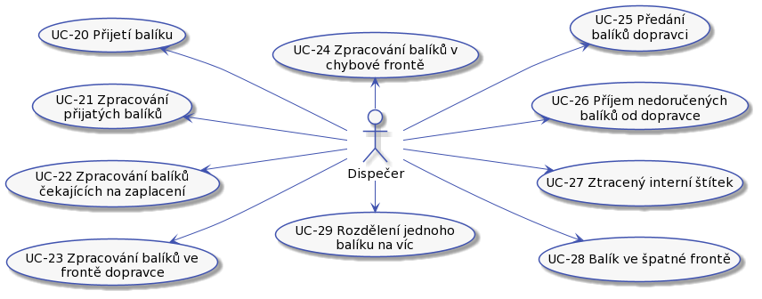
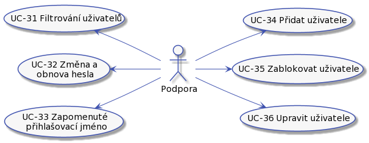

# Analýza
## Role

Máme tyto role:

### Zákazník

Zákazník naší doručovací služby. Může to být fyzická osoba nebo společnost.

Zákaznik můze:

* UC-04 [Registrovat balík](../uc-00/#uc-04).
* UC-05 [Doručit balík do depa](../uc-00/#uc-05).
* UC-06 [Sledovaní balíku](../uc-00/#uc-06).
* UC-07 [Zaplatit za doručení](../uc-00/#uc-07).

### Uživatel

Představuje někoho, kdo má přístup do systému. Podle své specializace má další možnosti.

Uživatel můze:

* UC-10 - [Přihlásit se pomocí jména a hesla](../uc-10/#uc-10).
* UC-11 - [Zapomenuté heslo](../uc-10/#uc-11).
* UC-12 - [Zapomenutý login](../uc-10/#uc-12).
* UC-13 - [Odhlášení ze systému](../uc-10/#uc-13).

### Dispečer

Dispečer je pracovník doručovací služby odpovědný za činnosti s balíkem od převzetí balíku od dopravce až po předání dalšímu dopravci.

Dispečer je v depu. Depo bude umístěné tak, aby bylo v dobrém dosahu dopravců. Co dispečer dělá:

* UC-20 - [Přijetí balíku](../uc-20/#UC-20).
* UC-21 - [Zpracování přijatých balíků](../uc-20/#UC-21).
* UC-22 - [Zpracování balíků čekajících na zaplacení](../uc-20/#UC-22).
* UC-23 - [Zpracování balíků ve frontě dopravce](../uc-20/#UC-23).
* UC-24 - [Zpracování balíků v chybové frontě](../uc-20/#UC-24).
* UC-25 - [Předání balíků dopravci](../uc-20/#UC-25).
* UC-26 - [Příjem nedoručených balíků od dopravce](../uc-20/#UC-26).
* UC-27 - [Ztracený interní štítek](../uc-20/#UC-27).
* UC-28 - [Balík ve špatné frontě](../uc-20/#UC-28).
* UC-29 - [Rozdělení jednoho balíku na víc](../uc-20/#UC-29).

### Pracovník podpory

Pracovník naší doručovací služby. Vyřizuje reklamace, nespárované balíky a pomáhá s procesem doručení balíku.

Pracovník podpory může být fyzicky na centrále. Pracovník podpory je odpovědný za:

#### Správa uživatelů

* UC-31 - [Filtrování uživatelů](../uc-30/#UC-31)
* UC-32 - [Změna/obnova hesla](../uc-30/#UC-32)
* UC-33 - [Zapomenuté přihlašovací jméno](../uc-30/#UC-33)
* UC-34 - [Přidat uživatele](../uc-30/#UC-34)
* UC-35 - [Zablokovat uživatele](../uc-30/#UC-35)
* UC-36 - [Upravit uživatele](../uc-30/#UC-36)

#### Práce s platbou a daňovým dokladem

* UC-40 - [Kontrola bankovního účtu](../uc-40/#UC-40 "Kontrola bankovního účtu").
* UC-41 - [Párování plateb](../uc-40/#UC-41 "Párování plateb").
* UC-42 - [Odpárování platby](../uc-40/#UC-42 "Odpárování platby").
* UC-43 - [Urgence zaplacení](../uc-40/#UC-43 "Urgence zaplacení").
* UC-44 - [Řešení přeplacených objednávek](../uc-40/#UC-44 "Řešení přeplacených objednávek").
* UC-45 - [Řešení zaplacených objednávek, ke kterým nedorazil balík](../uc-40/#UC-45 "Řešení zaplacených objednávek, ke kterým nedorazil balík").
* UC-46 - [Vystavení dobropisu](../uc-40/#UC-46 "Vystavení dobropisu").
* UC-47 - [Vystavení upravené faktury](../uc-40/#UC-47 "Vystavení upravené faktury").
* UC-48 - [Úprava objednávky](../uc-40/#UC-48 " Úprava objednávky").

#### Správa objednávek a balíků

* UC-50 - [Storno objednávky](../uc-50/#UC-50 "Storno objednávky").
* UC-51 - [Změna doručovací adresy](../uc-50/#UC-51 "Změna doručovací adresy").
* UC-52 - [Spárování dvou balíků](../uc-50/#UC-52 "Spárování dvou balíků").
* UC-53 - [Označení objednávky za zaplacenou](../uc-50/#UC-53 "Označení objednávky za zaplacenou").
* UC-54 - [Reklamace](../uc-50/#UC-54 "Reklamace").
* UC-55 - [Řešení chybové fronty](../uc-50/#UC-55 "Řešení chybové fronty").
* UC-56 - [Řešení poškozeného balíku](../uc-50/#UC-56 "Řešení poškozeného balíku").
* UC-57 - [Zaznamenání doručení balíku](../uc-50/#UC-57 "Zaznamenání doručení balíku").
* UC-58 - [Přidat záznam do kontaktní historie](../uc-50/#UC-58 "Přidat záznam do kontaktní historie").
* UC-59 - [Ověření identity zákazníka](../uc-50/#UC-59 "Ověření identity zákazníka").
* UC-60 - [Likvidace balíku](../uc-50/#UC-60 "Likvidace balíku").
* UC-61 - [Odeslat balík na zpáteční adresu zákazníka](../uc-50/#UC-61 "Odeslat balík na zpáteční adresu zákazníka").
* UC-62 - [Přijetí emailu nebo telefonu od zákazníka](../uc-50/#UC-62 "Přijetí emailu nebo telefonu od zákazníka").
* UC-63 - [Vyhledání objednávky](../uc-50/#UC-63 "Vyhledání objednávky").
* UC-64 - [Vyhledání balíku podle objednávky](../uc-50/#UC-64 "Vyhledání balíku podle objednávky").
* UC-65 - [Poslat balíku na zpáteční adresu](../uc-50/#UC-65 "Poslat balíku na zpáteční adresu").

### Admin

Pracovník doručovací služby, který dohlíží na fungovaní systému.

Co může dělat admin:

* UC-70 - Zkontrolovat objednávky

### eShop

Zákazník, který má možnost zadávat hromadné posílaní balíků.

eShop může:

* UC-90 - Hromadná registrace balíků
