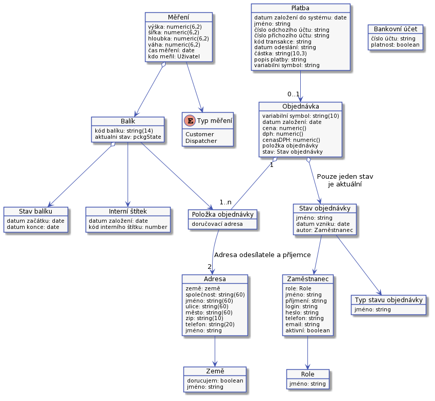
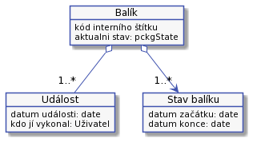
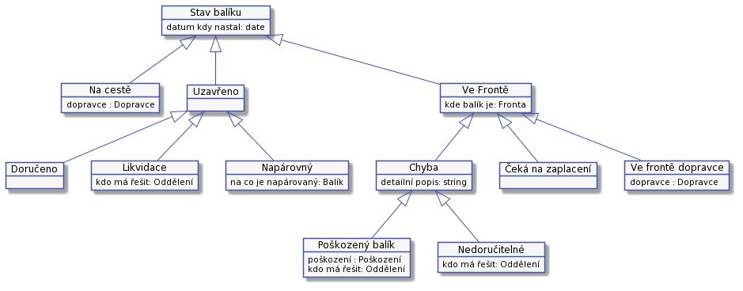

# Architektura

Technický návrh systému.

Nebude možné zde popsat všechny aspekty řešení. Prot jsou zde popsáný pouze části, které mají dopad na UC.

Několik pravidel:

* Při založení objednávky musí vzniknout instance balíku. Na ní je uložen kód balíku.
* Balík, který se při přijetí nepodaří spojit s objednávkou, nemusí mít kód balíku.

## Kód balíku

Kód balíku musí splňovat několik vlastností:

* I po lidské chybě, jako je záměna dvou znaků, nebo překlep jednoho znaku musíme být schopní balíček dohledat.
* Kód se musí pohodlně číst a opisovat.
* Nesmí obsahovat znaky, v které se často zaměňují jako jsou:
    * nula a velké O
    * malé L a jedna.

Jedno z možných řešení je, že se kód kód bude skládat ze tří pomlčkou oddělených částí po čtyřech znacích: ```XXXX-XXXX-XXXX```. Jednotlivé znaky budem náhodně generovat z těchto skupin:

* Souhlásky - ```b, c, d, f, g, h, j, k, m, n, p, r, s, t, v, x, z```
* Samohlásky a číslice - ```a, e, u, 2, 3, 4, 5, 6, 7, 8, 9```

Každá čtveřice bude vygenerovaná tak, že se budou střídat náhodné znaky z obou skupin. Střídat můžem i pořadí skupin. Například:

* ```K3GE-DAM8-ERUS```
* ```AT3K-8P3D-B4M6```

To nám dává ```34 969 = 17 * 17 * 13 * 13``` kódů v jedné čtveřici, celkem ```1,16 x 10^14``` možností.;

Pro každý balík, bude tento kód balíku vygenerovaný a uložený. Když operátor zadá kód balíku, pomocí nějakého algoritmu pro zjištění podobnosti dvou řetězců najdeme ten, který v nějaké toleranci odpovídá. Jako inspirace lze použít 	Levenshteinovu vzdálenost.

Je potřeba kontrolovat, jestli už v minulosti nebyl vygenerovaný kód balíku použitý?

## Kód interního štítku balíku

Jedná se o náhodné XXX místné číslo. Toto číslo se přiděluje balíku při přijetí. Významem nemůže být spjaté s objednávkou nebo zákazníkem, protože při přijetí balíku se nemusí podařit dohledat objednávku nebo zákazníka. Kód na interním štítku balíku bude vytištěn jako čárový kód i jako čísla.

Kód interního štítku balíku bude náhodné číslo. Náhodné, abychom je mohli dobře odlišit. Je možné, že budem implementovat hledání podle poškozené části. V aktuálním něvrhu to není.

## Číslo faktury

Variabilní symbol pro zaplacení objednávky, číslo objednávky a číslo faktury budou jedna hodnota. Bude to desetimístné náhodně vygenerované číslo. Formát variabilního symbol je, že to je libovolné desetimístné číslo.

## Unifikace zákazníků

V některých případech by bylo dobré mít samostatnou entity zákazníka a k ní napojené objednávky. Například bychom mohli lépe určit zákazníka podle čísla účtu příchozí platby. Lze to řešit tak, že se vezmou záznamy, které identifikují zákazníka. Například Jméno, příjmení, telefonní číslo, email: Při založení objednávky se projdou již existující zákazníci a zkusí se, jestli se s nějakou tolerancí nejedná o stejný záznam. Pro porovnání lze u něktrých polí Levenshteinovu zvdálenenost. Případně lze shodu porovnávat pouze podle emailu nebo telefonního čísla.
**Toto teď nebudem implementovat. Zákazníka poznáme podle emailu.**
## Entitní model
Zde budou popsány vztajy mezi objekty a základní set attributů.

Vztahy mezi základními objekty budou vypadat takto:


### Objednávka

### Balík
U balíku se uchovává:

* Stav balíku - ze stavů je možné vyčíst, co se dějě a řídit, co se má stát.
* Událost - jednorázová událost, která nemění stav balku. Například měření a vážení.



#### Stavy balíku
U balíku je třeba evidovat několik různých stavů. Jednotlivé stavy se od sebe mohou lišit počtem atributů a způsobem práce s nimi. Například stav "Poškozený balík" může být přiřazen na dispečera nebo pracovníka podpory. Ostatní stavy jsou vždy přiřazeny na jednu roli. Například pokud je balík ve frontě, kde čeka na zaplacení, tak pouze pracovník podpory může říct, že je balík zaplacen a přesunout ho do fronty konkrétního doporavce.



## Návrh architektury applikace
Z počátku nepotřebujem nic speciálního. Pouze při realizací dávat pozor, že finální UC se mohou lišit od návrhů. Například implementace napojení na konkrétního dopravce může ovlivnost způsob zpracování fronty dopravce. Například požadavek na validaci adresy ze strany dopravce může vést k tomu, že při přijetí balíku a po jeho spárování s objednávkou se musí přidat validace adresy.

## Auditní log
Systém nebude bezpečný. Bude možné vystavit fakturu zákazníkovy, změnit doručovací adaresu a podobné bez obvyklých kontrol. Z těchto důvodů budou změny ukládány do speciálního auditního logu. Log nebude systémem dále využíván. Pro kontrolu by nad ním měl být vybudovaný nějaký jednoduchý BI systém. Auditní log by měl být textový soubor, kde jednotlivé řádky budou představovat jednotlivé události. Událost se bude skládat z několika vhodně oddělenými poli v následujícím poředí:

* Datum a čas vzniku události.
* Kdo událost vyvolal. Zde bude systém, nebo jméno konkrétního uživatele.
* V jakém UC byla událost vyvolaná.
* O jaký druh entity se jedná.
* Identifikace měněné entity.
* Popis změny. Například když pracovník změní doručovací adresu, pak by zde měla být nová adresa.
* Jakékoliv další informace, které později můžou pomoct.

Auditní log by se měl z bezpečnostních důvodů uládat jinam než provozní logy.

## Zajímavé odkazy
Další informace jsou na:

* Wikipedia, Kontrolní číslo - [https://en.wikipedia.org/wiki/Check_digit](https://en.wikipedia.org/wiki/Check_digit)
* Wikipedia, Levenshteinova vzdálenost - [https://en.wikipedia.org/wiki/Levenshtein_distance](https://en.wikipedia.org/wiki/Levenshtein_distance)
* Wikipedia, Variabilní symbol - [https://cs.wikipedia.org/wiki/Variabilní_symbol](https://cs.wikipedia.org/wiki/Variabiln%C3%AD_symbol)
* Wikipedia, Čárový kód - [https://cs.wikipedia.org/wiki/Čárový_kód](https://cs.wikipedia.org/wiki/Čárový_kód)
