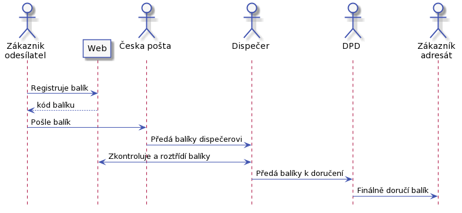

# Postman

Služba pro zasílání balílků po světě.

V [poznámkách](./notes/) je, co jsem si odnesl z našeho povídání. Zbytek je v [analyze](./analyza/).

## Priority projektu

Seřazené podle významu jsou:
 
1. Uvést službu na trh co nejrychleji.

1. Během návrhu a vývoje vše dokumenatovat, aby bylo možné vybudovat zastupitelnost.

1. V technickem návrhu přihlížet k rozšiřitenosti služby do budoucna.

## Jak to bude fungovat

Se zákazníkem budem komunikovat:

* email
* telefon

## Busines otázky ##

* Jak to bude s odváděním DPH.
* Musíme baliky pojišťovat? Lze pojištění nabízet klientovi?
* Jakou nesem odpovědnost za nebezpecné a nelegální zásilky?

