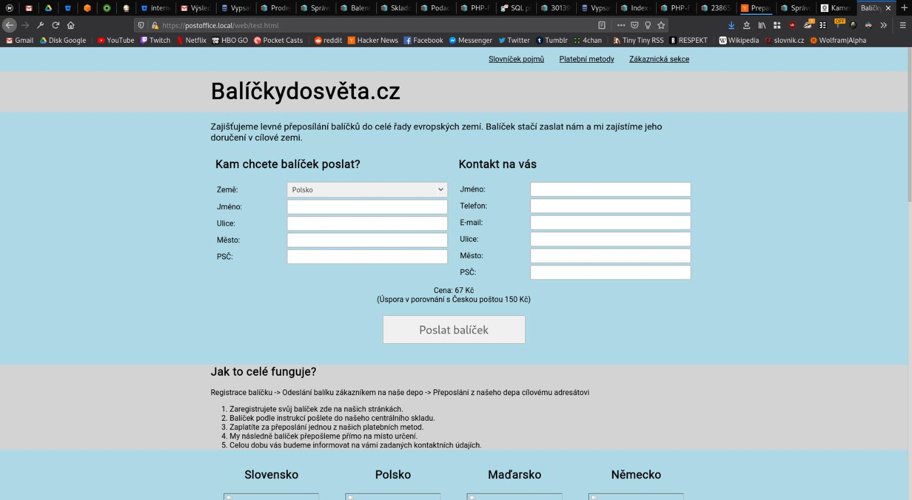

# Poznámky

## Otevřené otázky, nápady

* Jaký čárový kód tisknem na balíky? Je to EAN-13?
* Je povinnost posílat dobropis, v případě, že zákazník zruší objednávku, ale ještě neposlal penize?
* Pro oveření identity volajícího zákazníka se můžem optat na kód balíku. Nebo tačí spoléhat na telefonní číslo na objednávce? UC-59.
* Zrušíme tisknuti doručoivací adresy na interni štítek? V UC-51 se adresa muze zmenit a v pripade nesparovaneho baliku ji nemusime znat.
* Budem uchovávat původní hodnoty z objednávky? (Cena za dopravu, dorucovaci adresa, adresa odesilatele, ....)
* Pokud se nepodaří ověřit identitu volajícího zákazníka nebo příchozího emailu. Pak nechávám na domluvě, jak takovou událost pracovník podpory zaznamená k dalšímu posouzení. Řešení by mohla být kontaktní historie nenavázaná na zákazníka.
* Potřebujeme mít někde uloženou objednávku, tak jak jí zadal zákazník? Například pro porovnání. Určitě bude v auditním logu.
* U stavů mít detailní obrázek se stavy a přechodů napsané UC.
* Pracovník podpory si při řešení chybových stavů balíku nemůže objednat další focení nebo měření.
* Když označují balík za doručený, zatím nezohlednuji, že existuje více než jedno depo.
* Nebudem řešit stav, kdy fakturace proběhne na osobu na jedné adrese, ale zpáteční adresa balíku má být jiná.
* Když dojde ke storno, vystavení dobropisu možné ne povinné. Má se dobropis vystavit i když nepřisli peníze?.

## Kontakty na nás:

| Kdo        | Email          | Github account |
| ---------- |----------------|----------------|
| Bivoj | [xbivoj@gmail.com](mailto:xbivoj@gmail.com)|
| Viktor Friš | [viktorfris420@gmail.com](mailto:viktorfris420@gmail.com)|
| Vojta Balák | [vojtech.balak@internet-handel.cz](mailto:vojtech.balak@internet-handel.cz)| remedan-ih |
| David Ježek | [david@internet-handel.cz](mailto:david@internet-handel.cz)|DDejv|
| Honza Jirout | [jirout@gmail.com](mailto:jirout@gmail.com)| jajir |

# Zápisy ze starých schůzek

## 08.04.2020

Na čem jsme se domluvili:

* Vojta sepíše vývojařské desatero a přidá ho do dokumentace.
* Honza:
    * Pozve lid do repa
    * Repo udělá privátním
    * Nástřel UC na hromadné podávání
* Projekt pojedem podle analýzy, co není popsané neprogramujem.
* Co jsme nakousli, ale nedokončili:
    * Vznikne nejaká vrstva technické dokumentace mezi analýzou a php kódem.
* Naplánuju schuzku na 10.4.
* Ostatní kluci vyzkoušíjí php frameworky a založí kostru projektu.

## 07.03.2020

* Prošli jsme všechny UC.
* Nebudem podporovat odložené poslaní balíků.
* Přepravce a dopravce není to samé. Postman má blíž k činnosti dopravce. DPD a česká posta jsou dopravci.

## 02.03.2020

* Prosli jsme procesy objednavky a balíků

## 29.02.2020

* Nebudem aktivne rikat zakaznikovy, jakeho dopravce pouzivame. Muze pozdeji zjistit.
* Nebudel lidi navolavat z rozdelanych zadosti. Tede je ani nebudem ukladat.
* Prevazujem baliky z odchozi fronty vzdy. Radeji neodeslem, nez neprevazime.

## 28.02.2020

* Omezíme pouze na Německo.
* Řešili jsme UC-04.

## 24.02.2020

* Zakaznik se nemusi hlasit heslem/loginem a ani nema tuto moznost.
* Jako admin nepotrebuju videt nic, udelam ad-hoc vypis z databaze.
* Komunikacni kanaly pro zakaznika telefon, email, zadavaci formular pro poslani?
* Ano chceme zakaznikovi umet potvrdit doruceni.
* Nektere UC rovnou oznacime jako nizssi prioritu.
* Prosli jsme cast UC supportu.
* Vznikne zmenovy zurnal, staci standardni textovy log, kde bude cas a zmena pole u objednavky. Nebude delat vyhledavani v zurnalu.
* Dobropisy nebudem automatizovat v prvni fazi.
* Reseni odmitnutych nebo nedorucenych zasilek.
* Dostal jsem starsi verze obrazovek registracni formular.
* Od klienta data pouze sbirame, validace se dela klidne rucne.

## 22.02.2020 co jsme si rikali 

* Bivoj potrebuje navrh systemu. Hlavne:
     * Analyzu & logickou architekturu.
     * Cil je usetrit opakovane vysvetlovani reseni.
     * Zalezi mu na moznosti dal system rozvijet.
* Tisk stitku
* Napojeni na prepravce (DPL). Uz je v nejakem stavu hotove.
* Registrace.
* Web pro zakazniky. (Jmeno tel. cilova adreasa, zpatechni).
* Prehazovac
* Pokyny k uhrade pro zakaznika.
* Pipac.
* Admin.
* Cekani na uphradu. Zbozi neposlu dal. Denne ho projedu znovu.
* Rozhrani pro eshopy. Hromadna podani. V dalsich fazich API.
* GDPR prijatych informaci.
* Na balik bud vytisknout carovy kod, QR code, nebo napsat hash.
* bude to bezet v ruznych jazycich na ruznych domenach.
* Co zeme, kam dorucujem to vlastni trasa baliku.
* Pokud DPD nedoruci, pak vraci zpet. 

