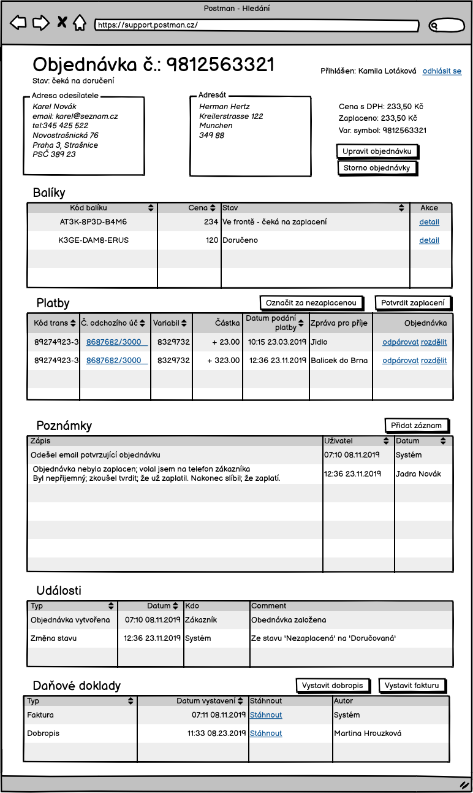
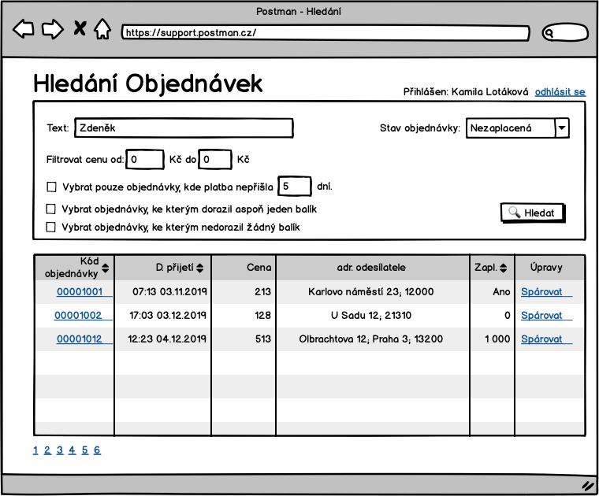

# Obrazovky

Zde jsou schematicky popsané obrazovky systému.

## S-000 - Info box

V některých případech systém potvrzuje, že operace dopadla dobře, nebo že neco není možné udělat a zárověn to nemá povahu validace pole. V těchto a podobných případech budem ukazovat oznámení:

Ve výsledku to může vypadat odlišně.

## S-00 - Přihlašovací obrazovka

Přihlašovací obrazovka

Chyba ve formuláři se zobarazí následovně:

## S-01 - Základní rozcestník

Sekci "Pracovník podpory" uvidí pouze pracovník podpory, stejně se chová sekce "Dispečer". Detaily toho, kdo co vidí jsou vidět za analýzy.

## S-02 - Odhlášení

## S-03 - Hledání balíků

Do pole hledat, pujde zadat část libovolné adresy, kód balíku, telefon zákazníka, čast jména, prostě cokoliv. 

## S-04 - Detail objednávky

## S-05 - Detail balíku

Může být součástí stránky [S-04 Detail objednávky](./#S-04)

## S-06 - Seznam plateb

V psledním sloupci bude vidět, jestli se platbu podařilo spárovat s objednávkou. Pokud ano, pak zde bude odkaz na detail objednávky.

Checkbox "Zobrazit pouze nespárované" platby umožní omezit pohled jen na nespárované.

Pokud je nějaké číslo odchozího účtu zvýrazněné jako odkaz, pak to znamená, ze z toho účtu nám přišlo víc platek a kliknutím na odkaz si lze tyto platby vyfiltrovat - [S-08 seznam plateb vyfiltrovaný podle odchozího účtu](./#S-08).	

## S-07 - Přidání platby

## S-08 - Seznam plateb vyfiltrovaný podle odchozího účtu 

## S-09 - Spárovat platbu s objednávkou 

Po potvrzení "Spárovat" nebo "Cancel" se uživatel vrací na stránku v výpisem plateb.

## S-10 - Hledání objednávek 

Objednávky lze filtrovat podle:

* textu v adresách
* minimální a maximální ceny objednávky
* nezaplacených objednávek

## S-11 - Spárovat objednávku s platbou

Po stisknutí "Spárovat" na S-10 se zobrazí obrazovka:

## S-12 - Seznam uživatelů

Odkaz na tuto stránku povede přímo z hlavního rozcestníku [S-01](./#S-01).

Poslední uživatel Milan Strnad není aktivní a nebude se moc přihlásit do systému.

## S-13 - Přidat uživatele

## S-14 - Upravit uživatele

## S-15 - Nastavit heslo uživatele

## S-200 - Dispečer
