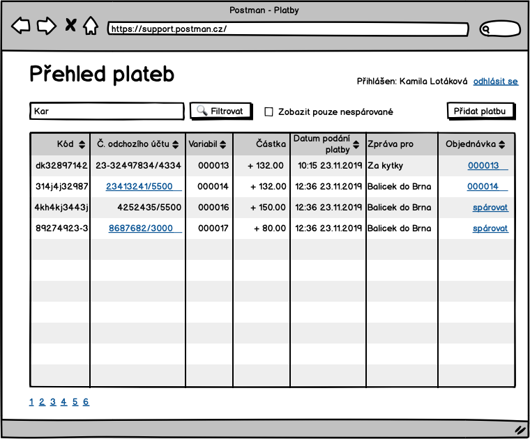
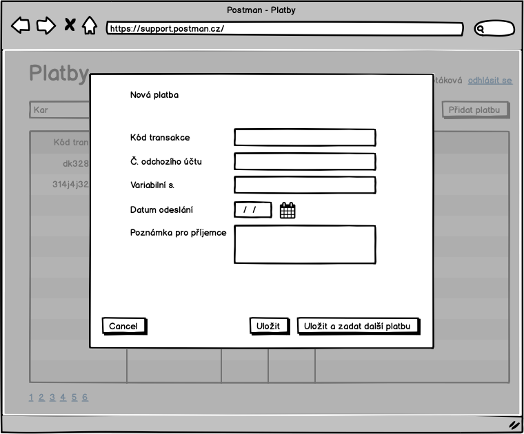
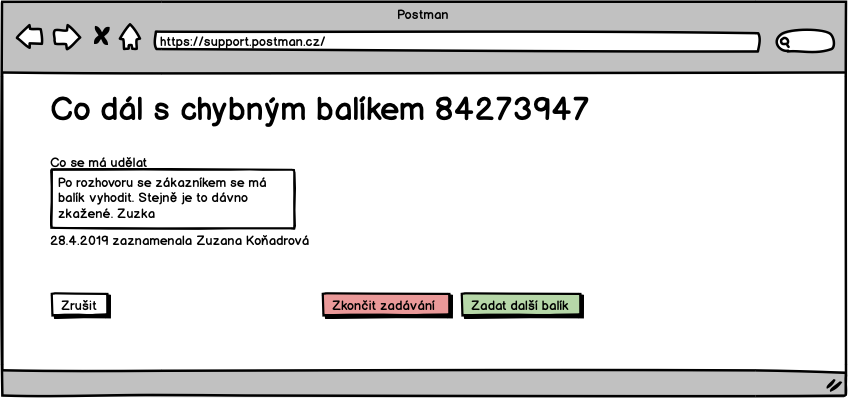

# Obrazovky

Zde jsou schematicky popsan칠 obrazovky syst칠mu.

## S-000 - Info box

V n캩kter칳ch p콏칤padech syst칠m potvrzuje, 쬰 operace dopadla dob콏e, nebo 쬰 neco nen칤 mo쬹칠 ud캩lat a z치rov캩n to nem치 povahu validace pole. V t캩chto a podobn칳ch p콏칤padech budem ukazovat ozn치men칤:

Ve v칳sledku to m콢쬰 vypadat odli코n캩.

## S-00 - P콏ihla코ovac칤 obrazovka

P콏ihla코ovac칤 obrazovka

Chyba ve formul치콏i se zobaraz칤 n치sledovn캩:

## S-01 - Z치kladn칤 rozcestn칤k

Sekci "Pracovn칤k podpory" uvid칤 pouze pracovn칤k podpory, stejn캩 se chov치 sekce "Dispe캜er". Detaily toho, kdo co vid칤 jsou vid캩t za anal칳zy.

## S-02 - Odhl치코en칤

## S-03 - Hled치n칤 bal칤k콢

Do pole hledat, pujde zadat 캜치st libovoln칠 adresy, k칩d bal칤ku, telefon z치kazn칤ka, 캜ast jm칠na, prost캩 cokoliv. 

## S-04 - Detail objedn치vky

## S-05 - Detail bal칤ku

M콢쬰 b칳t sou캜치st칤 str치nky [S-04 Detail objedn치vky](./#S-04)

## S-06 - Seznam plateb

V psledn칤m sloupci bude vid캩t, jestli se platbu poda콏ilo sp치rovat s objedn치vkou. Pokud ano, pak zde bude odkaz na detail objedn치vky.

Checkbox "Zobrazit pouze nesp치rovan칠" platby umo쬹칤 omezit pohled jen na nesp치rovan칠.

Pokud je n캩jak칠 캜칤slo odchoz칤ho 칰캜tu zv칳razn캩n칠 jako odkaz, pak to znamen치, ze z toho 칰캜tu n치m p콏i코lo v칤c platek a kliknut칤m na odkaz si lze tyto platby vyfiltrovat - [S-08 seznam plateb vyfiltrovan칳 podle odchoz칤ho 칰캜tu](./#S-08).	

## S-07 - P콏id치n칤 platby

## S-08 - Seznam plateb vyfiltrovan칳 podle odchoz칤ho 칰캜tu 

## S-09 - Sp치rovat platbu s objedn치vkou 

Po potvrzen칤 "Sp치rovat" nebo "Cancel" se u쬴vatel vrac칤 na str치nku v v칳pisem plateb.

## S-10 - Hled치n칤 objedn치vek 

Objedn치vky lze filtrovat podle:

* textu v adres치ch
* minim치ln칤 a maxim치ln칤 ceny objedn치vky
* nezaplacen칳ch objedn치vek

## S-11 - Sp치rovat objedn치vku s platbou

Po stisknut칤 "Sp치rovat" na S-10 se zobraz칤 obrazovka:

## S-12 - Seznam u쬴vatel콢

Odkaz na tuto str치nku povede p콏칤mo z hlavn칤ho rozcestn칤ku [S-01](./#S-01).

Posledn칤 u쬴vatel Milan Strnad nen칤 aktivn칤 a nebude se moc p콏ihl치sit do syst칠mu.

## S-13 - P콏idat u쬴vatele

## S-14 - Upravit u쬴vatele

## S-15 - Nastavit heslo u쬴vatele

## S-200 - Zad치n칤 k칩du bal칤ku

## S-201 - Zad치n칤 zp치te캜n칤 adresy

## S-202 - Kontrola zp치te캜n칤 adresy

## S-203 - Je bal칤k po코kozen?

## S-204 - Po코kozen칤 bal칤ku

## S-205 - Tisk intern칤ho 코t칤tku 游둳

## S-206 - Zad치n칤 spot콏eby obalov칠ho materi치lu

## S-207 - M캩콏en칤 a v치쬰n칤

V코echna pole jsou povinn치 a mus칤 obsahovat 캜칤seln칠 hodnoty.

## S-208 - Fronta kam m치 b칳t bal칤k vlo쬰n

## S-209 - Na캜ten칤 intern칤ho 코t칤tku

Str치nka pro na캜칤t치n칤 intern칤ho 코t칤tku se na캜te tak, ze focus je v poli pro k칩d intern칤ho 코t칤tku. To umo쬹칤 dispe캜erovi 캜te캜kou na캜칤t 캜치rov칳 k칩d bez dal코칤ho klik치n칤. Stejn캩 tak by str치nka m캩la poznat, 쬰 k칩d byl na캜ten a p콏ej칤t na dal코칤 str치nku bez potvrzov치n칤 tla캜칤tkem "pokra캜ovat".

Na str치nce by m캩la b칳t validace, 쬰 k칩d intern칤ho 코t칤tku existuje a bal칤k je ve spr치vn칠m stavu. To co je spr치vn칳 stav zavis칤 na pou쬴t칠m UC.

## S-210 - Co d치l s chybov칳m bal칤kem

## S-211 - Na캜ten칤 intern칤ho 코t칤tku 2

Stejn치 str치nka jako je S-209 s t칤m, 쬰 na obrazovce je mo쬹ost zadat, 쬰 bal칤k nem치 intern칤 코t칤tek.

