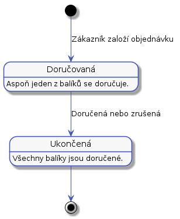
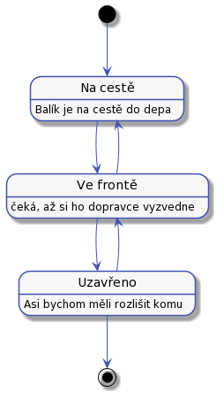

# Stavy

Objednávky a balíky během vyřizování procházejí několika stavama. V první verzi, kde budeme mít právě jeden balík na objednávky, bude možné následující stavy spojit v jeden.

## Stavy objednávek

Objednávka prochází následujícími stavy:

## Stavy jednotlivých balíků

Balíky během doručování procházejí následujícími stavy:

Balík bude ve stavu "Na cestě" aspoň dvakrát jednou od zákazníka do depa a podruhé z depa k adresátovi. Ze stavu "Na cestě" se může balík dostat do stavu "Přijat" a pak do stavu "Chyba". To se stane v případě, že zákazník odmítne balík převzít, nebo se ho nějakého jiného důvodu nepodaří doručit.

U balíčků je třeba znát historii všech stavů. To je potřeba pro reklamace a evidenci, poohybu balíku. To lze později využít pro optimalizaci procesů. 