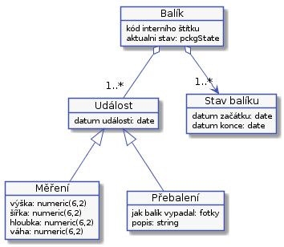

# Stavy

**Doplnit k UC přechody mezi stavy.**

Objednávky a balíky během vyřizování procházejí několika stavama. V první verzi, kde budeme mít právě jeden balík na objednávky, bude možné následující stavy spojit v jeden.

## Stavy objednávek

Objednávka prochází následujícími stavy:

Podle všeho u objednávky nebudem potřebovat evidovat stavy.

## Stavy jednotlivých balíků
U balíků je třeba znát historii všech stavů. To je potřeba pro reklamace a evidenci pohybu balíku. Historii stavů lze později využít pro optimalizaci procesů.

Balíky během doručování procházejí následujícími stavy:

Balík bude ve stavu "Na cestě" aspoň dvakrát jednou od zákazníka do depa a podruhé z depa k adresátovi. Ze stavu "Na cestě" se může balík dostat do stavu "čeká na zaplacení" a pak do stavu "Chyba". To se stane v případě, že zákazník odmítne balík převzít, nebo se ho nějakého jiného důvodu nepodaří doručit.

###Stav "Čeká na zaplacení"
To, jestli zákazník zaplatil by mohlo byt hodnoceno automaticky. Třeba porovnáním součtu částek daňových dokladů a součtu plateb. Bohužel to takto zjednodušit nelze. Některé daňové doklady nemusí být uhrazeny nebo proplaceny a je to tak v pořádku, stejně tak součet cástek na daňových dokladech nemusí být stejný jako součet plateb a také to může být v pořádku. 

###Stav "Chyba"
Je stav, kdy se nastane další problém, na jehož pracování nemáme připravený proces. Například, dopravce vrátí balík jako nedoručitelný.

####Stav "Poškozený balík"
Není to samostatný stav, ale případ chybového stavu. Je to druh chyby, kdy dispečer zjistí, že balík je poškozený a je třeba se zákazníkum domluvit další postup.

Stav, kdy je bal9k ve frontě, může znamenat některou z následujících událostí.

**TODO - Domalovat koncove stavy - doruceno, likvidace ....**

**TODO - Doplnit, jak se řeši měření, budu potřebovat záznam o přijetí? Tisk štítku. je sakce.**

