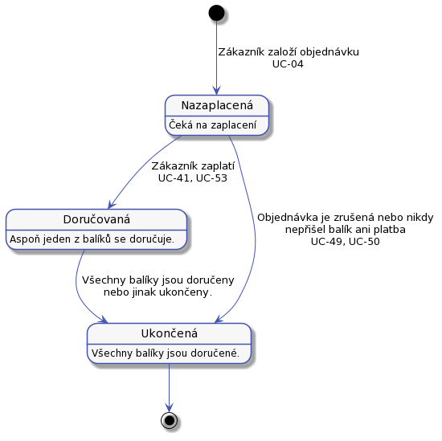

# Stavy

Objednávky a balíky během vyřizování a doručování procházejí několika stavy.

## Stavy objednávek

Objednávka prochází následujícími stavy:



###Stav `Nezaplacená`
Právě založená objednávka bude ve stavu `Nezaplacená`.


###Stav `Doručovaná`
O objednávce v tomto stavu víme, že je zaplacená, a s balíkem se ještě nějak pracuje a je třeba sledovat jestli a jak doručovací proces běží. 

Přechod mezí stavy `Nezaplacená` a `Doručovaná` se provede ve chvíli, kdy zákazník zaplatí. V některých případech k zaplacení nedojde, například když zákazník zruší objednávku.

To, jestli zákazník zaplatil by mohlo byt hodnoceno automaticky. Třeba porovnáním součtu částek daňových dokladů a součtu plateb. Bohužel to takto zjednodušit nelze. Některé daňové doklady nemusí být uhrazeny nebo proplaceny a je to tak v pořádku, stejně tak součet částek na daňových dokladech nemusí být stejný jako součet plateb a také to může být v pořádku.
 
###Stav `Ukončená`
V tomto stavu máme objednávku kompletně ukončenou, všechny doručované balíky jsou také ukončeny a finance vypořádány.

Přechod do tohoto stavu provede systém automaticky ve chvílí, kdy je poslední balík objednávky v koncovém stavu. Toto musí fungovat i naopak, pokud se později ručním zásahem, nebo procesem nějaký balík přesune do jiného stavu než koncového, pak se musí i objednávka přesunout do stavu `Doručovaná`.

###Další přechody zpět

Pro zpětné přechody:

* `Ukončená` --> `Doručovaná` - tento přechod se bude dít automaticky, na základě změny stavu balíku.
* `Doručovaná` --> `Nezaplacená` - pro tento přechod bude na stránce tlačítko.

Budou na stránce [detailu objednávky S-04](../screens/#S-04) příslušná tlačítka. 

## Stavy balíku
U balíku je třeba znát historii stavů. To je potřeba pro reklamace a evidenci pohybu balíku. Historii stavů lze později využít pro optimalizaci procesů.

Balík během doručování prochází následujícími stavy:


### Stav ```Na cestě```
Balík bude ve stavu ```Na cestě``` aspoň dvakrát jednou od zákazníka do depa a podruhé z depa k adresátovi. Ze stavu ```Na cestě``` může balík přet do fonty, kde čeká na zaplacení. V případě, že se balík vrátí od dopravce jako nedoručitelný, pak půjde do chybové fronty ve stavu ```Chyba```.

###Stav ```Ve frontě```
Balík je ve stavu ```Ve frontě``` kdykoliv je v depu a čeká na nějakou další událost. Například:
 
 * Odevzdání dopravci.
 * Vyřešení problému s poškozeným balíkem.
 * Čeká na zaplacení.

### Stav ```Poškozený balík```
Není to samostatný stav, ale případ chybového stavu. Je to druh chyby, kdy dispečer zjistí, že balík je poškozený a je třeba se zákazníkum domluvit další postup. V tomto stavu je balík přiřazen na dispečera nebo pracovníka podpory. Například když balík vyžaduje nějakou informaci od dispečera. Nebo dispečer dostane pokyn k rozdělení balíku na několik samostatných. 

###Stav ```Uzavřeno```

Vše, co bylo potřeba s balík udělat je hotovo. Například balík byl úspěšně doručen adresátovi, nebo  byl zlikvidován.

### Přehled stavů balíku

Popsal jsem jenom hlavní stavy, ale balík v závislostu na scénáři může být v dalších stavech. Seznam stavů a vztahy mezi nimi je na následujícím obrázku:


