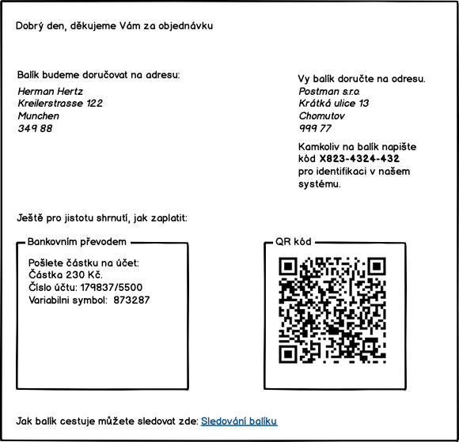

# Šablony

## T-01 potvrzení o přijetí objednávky

Tento email budeme odesílat jako potvrzení přijetí objednávky. Šablona emailu bude vypadat následovně:

### T-02 Potvrzení o zaplacení

Když zjistíme, že jsme přijali platbu zákazníka, pak mu odešlem email podle šablony:

### T-03 Faktura

Faktura, kterou zákazník dostane, bude PDF dokument podle šablony:

### T-04 Dobropis

Dobropis, který zákazník dostane, bude PDF dokument podle šablony:

### T-05 Potvrzení o doručení

Když se podaří balík doručit na cílovou adresu, tak pošleme zákazníkovi na email potvrzení:

### T-06 Interní štítek balíku

Tento štítek se nalepí na balík po jeho přijetí. Než předáme koncovému přepravci, tak interní štítek přelepíme dodacím štítkem dopravce. Proto bude mit interní štítek velké bílé prazdné okraje, aby šel snadno překrýt. Zároveň tento interní štítek musí být vzhledově hodně jiný než dodací štítek přepravce, aby nedošlo k záměně.

Velké tiskací `E` značí, že štítek byl tisknut, protože nastala chyba. Podle všeho je to zbytečné, protože štítky tiskneme pouze v případěě chyby.
