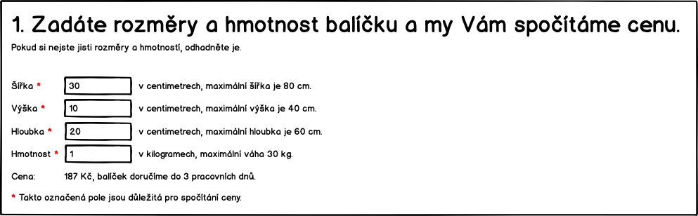
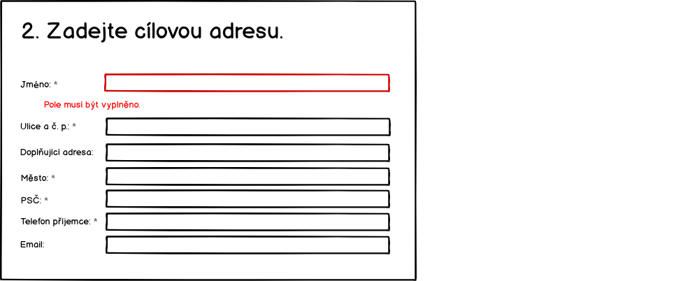
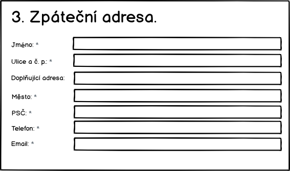

# Zákazník
## UC-04 Registrovat balík

Zákazník objednává doručení balíku na cílovou adresu. Celý proces zadání objednávky je rozdělený do několika kroků.

Pokud zákazník nějaké informace vyplní a později se k nim vrátí, aby je upravil, pak se všechny ostatní již vyplněné informace zachovají. Například pokud se dostane na pokyny k zaplacení, pak se vrátí a upraví cílovou adresu, nesmaže se adresa odesílatele.

Pokud se změní v hlavním nadpisu cílová země doručení, pak se přepočte část stránky s cenou a znovu vygeneruje QR kód. To se stane pokaždé, když zákazník změní údaj, který ovlivní výslednou cenu.

Protože se zadávání objednávky odehraje na jednom formuláři, budou se pole validovat při jejich opuštění.

### Úvod

Na tuto obrazovku přicházi zákazník z vyhledávače. Cílová země bude vyplněná, protože její hodnota přichazí z vyhledávače jako parametr. Pokud zákazník nepřijde ze systému, který posílá v URL zvolenou zemi, pak se zobrazí Německo.


**TODO (TECH) Jaký parametr to bude? Jaké má hodnoty? Nějaké kódováni?**

### Zákazník zadá rozměry a hmotnost

Zjištění ceny je jako první, protože to je to, co ho zajímá nejvíc. Nalákali jsme ho na to.

V tomto kroku zákazník vyplní:

* Šířku, výšku a hloubku balíku - hodnoty musí být číslo.
* Hmotnost v Kg - hodnota musí být vyplněná a musí být číslo, lze i desetinné a budem brát formáty s tečkou i čárkou.



Po každé změně jakéhokoliv pole přepočítáme výslednou cenu. Cena je pro zákazníka rozhodující parametr.

Případné chyby se zobrazí následovně:


Další validační hlášky jsou:

* (40 kg) Maximální hmotnost balíku je 30 kg, rozdělte zásilku na více balíků.
* (-3 kg) Chybně vyplněná hmotnost.
* (Výška 120 cm) Maximální výška balíku je 80 cm.

### Zadáni cílové adresy

Požádáme o zadání doručovací adresy.


Zákazník zadá cílovou doručovaci adresu. Zvalidujeme, že jsou požadovaná pole vyplněná a odpovídají požadavkům.

Validace:

* Jméno
    * musí být vyplněno. "Pole musí být vyplněno."
    * maximální délka je 255 znaků. "Maximální délka pole je 255 znaků."
    * povolené jsou alfanumerické znaky a '-', '.', ','. Jinak vypíšem hlášku "Pole obsahuje nepovolené znaky.".
* Ulice a č. p.
    * musí být vyplněno. "Pole musí být vyplněno."
    * maximální délka je 255 znaků. "Maximální délka pole je 255 znaků."
    * povolené jsou alfanumerické znaky a '-', '.', ','. Jinak vypíšem hlášku "Pole obsahuje nepovolené znaky.".
* Doplňující adresa
    * pole není povinné.
    * maximální délka je 255 znaků. "Maximální délka pole je 255 znaků."
    * povolené jsou alfanumerické znaky a '-', '.', ','. Jinak vypíšem hlášku "Pole obsahuje nepovolené znaky.".
* Město
    * musí být vyplněno. "Pole musí být vyplněno."
    * validace na maximální délku 255 znaků bude stejná jako v prvním prípadě.
* PSČ
    * musí být vyplněno. "Pole musí být vyplněno."
    * validace na maximální délku 10 znaků bude stejná jako v prvním prípadě.
    * povolené jsou jen číslice a mezery.
* Telefon příjemce
    * musí být vyplněno. "Pole musí být vyplněno."
    * validace na maximální délku 15 znaků bude stejná jako v prvním případě.
    * povolené je '+' na začátku, pak už jen číslice.
    * min. délka 5 znaků.
* Emailová adresa
    * nemusí být vyplněná, emailová adresa doručovatele není povinná.
    * pokud zákazník emailovou adresu vyplní, kontrolujeme, zda je validní.

Validace budou zobrazovat následovně:



### Zadání zpáteční adresy

Zákaznik zadá zpáteční adresu. Adresu budeme validovat pouze že je vyplnená, ale ne, ze je platná. Museli bychom mít validace na další státy.

Zákazník zadá:

* Jméno - to využijeme pro případné zaslání balíku na zpáteční adresu a osloveni v emailech.
* Email - na email budem posílat shrnuti objednávky s instrukcemi kam zaplatit a poslat balík
* Telefon - Když se něco pokazí, pracovník podpory bude volat, aby domluvil dalsi postup.



Validace:

* pole Jméno, Ulice, Doplňující adresa, Město, PSČ, Email a Telefon:
    * musí být vyplněno. "Pole '***' musí být vyplněno."
    * validace na maximální délku 255 znaků bude stejná jako v předchozích prípadech.
    * validace na alfanumerické znaky bude stejná jako v předchozích prípadech.
    * validace regulárem na email - stačí základní na kontrolu zavináče a tečky.

Validace se budou zobrazovat jako při zadávání cílové adresy:

### Platba

Zakazník si může vybrat, jak chce platit. Pokud v tomto kroku nezaplatí, tak to nevadí. Platební pokyny mu pošleme pro jistotu v potvrzovacím emailu.


Pokud dojde k validační chybě v části formuláře, kde se počítá cena, pak se místo QR kódu a částky zobrazí šedá oblast.

### Posláni baliku k nám a dokončení objednávky

Zde zákazník uvidí, jak má poslat balík do našeho sběrného místa (depa). Je důležité přinutit zákazníka, aby dal na balík správný kód balíku. I když to neudělá, tak si pozdějí můžem částečně pomoct adresou odesilatele, rozměry a váhou.


V tomto kroku zákazník potvrdí dokončení objednávky. Ve chvíli potvrzení provedeme:

* Ukládáme data do systémů.
* Pošleme email s potvrzením objednávky zadanou adresu.
* Zobrazí se samostatná stránka s poděkováním.

Počítáme s tím, ze pokud zákazník nestiskne tlačítko, pak se žádná data do systémů neuloží.

### Závěr

Poděkování a informace o tom, že jsme poslali potvrzení v emailu.


## <a name="uc-05"></a>UC-05 Doručit balík do depa

To je UC, který dělá zákazník sám a v tuto chvíli mu nebudem nijak pomáhat.

## <a name="uc-06"></a>UC-06 Sledování balíku

Zákazník bude možnost sledovat stav zásilky. Stránka, kde se to dozví bude vypadat následovně:


Na stránku se dostane z odkazu, který bude vypadat:

```
https://postman.cz/sledovani-baliku/<kod-baliku>
```
S tím, že ``<kod-baliku>`` se nahradí skutečným kódem balíku.

Tento odkaz bude umístěn na šabloně [potvrzující objednávku](../templates/#T-01 "šablona potvrzující objednávku") a [zaplacení](../templates/#T-02 "šablona potvrzující zaplacení")

## <a name="uc-07"></a>UC-07 Zaplatit za doručeni

Původně to byl samostatný krok, teď je to součást UC-04.
