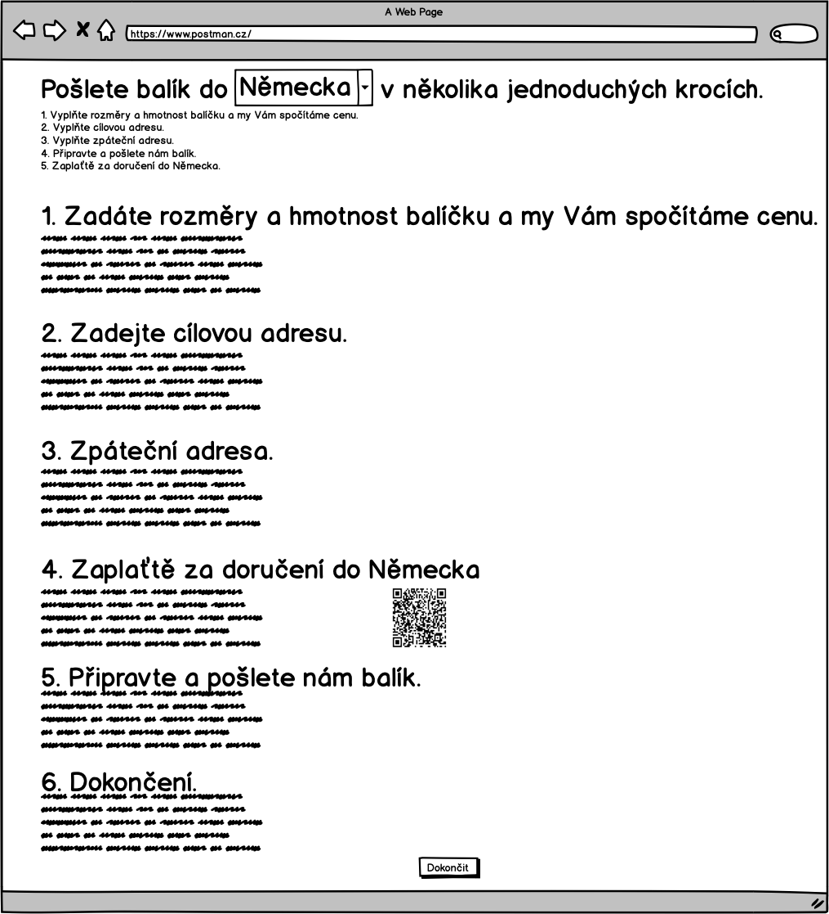
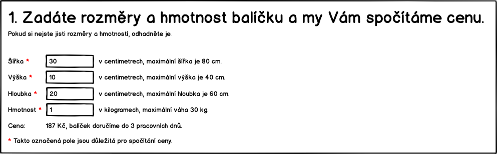
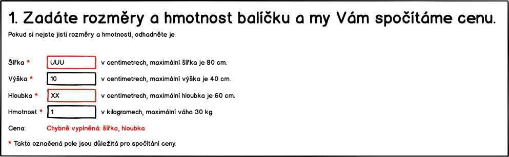
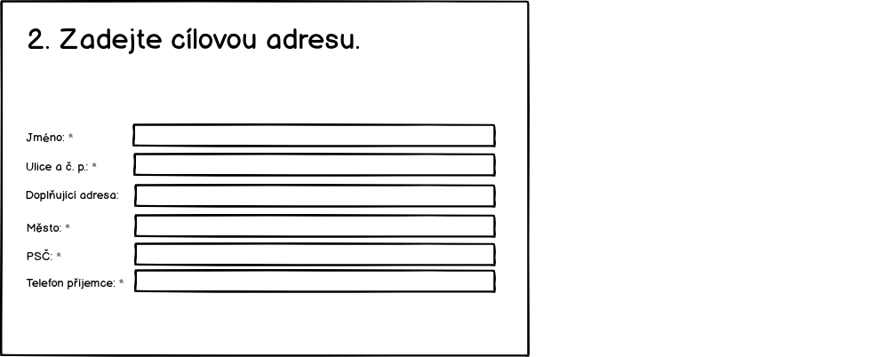
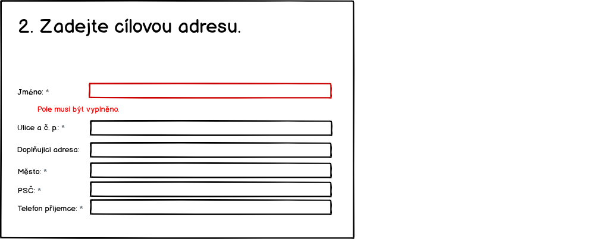
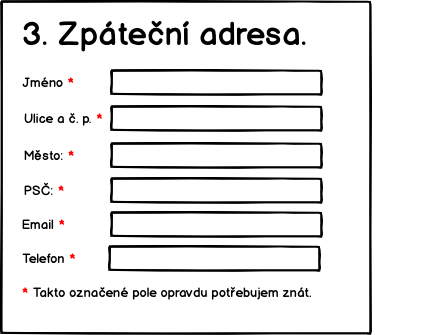
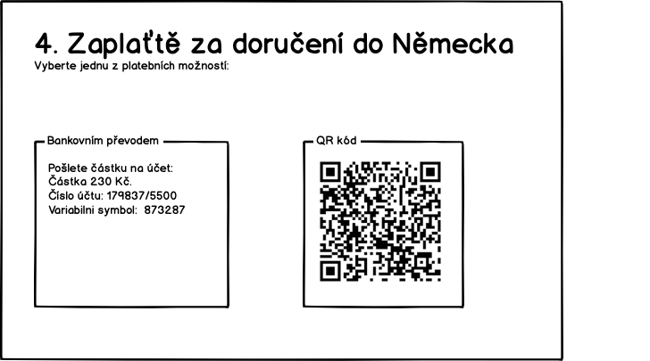
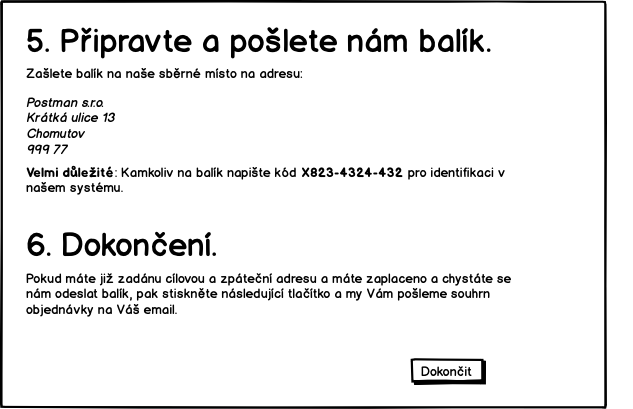
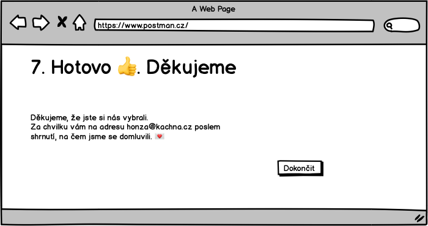

## UC-04 Registrovat balík

Zakaznik objednava doruceni na cilovou adresu. Cely proces je rozdeleny do něskolika kroku.

Rozdeleni na jednotlive stranky je kvuli vetsi prehlednosti navrhu. Finalne cele udelame na jedne strance.

Pokud zákazník nějaké informace vyplní a později se k nim vrátí, pak se mu ty následně vyplněné nesmažou. Například, pokud se dostane na pokyny k zaplacení pak se vrátí a upraví cílovou adresu, pak se mu nesmaže adresa odesílatele.

Pokud se bude realizovat na jedné stránce, pak s vyjimkou cílové země. Pokud jí změní v hlavním nadpisu, pak se mu přepočte stránka s cenou. Pokud změní další informace, například podklady k platbe, pak se mu budou přegenerovávat QR kód a další informace.

### Úvod

Na tuto obrazovku přicházi zákazník z vyhledávače. Proto mu můžem předvyplnit zemi. Protoze jsme na to cílili reklamu. Hodnota zeme prichazi jako parametr.

Pokud to budem v době spuštění umět, pak se jméno země objeví jako dropdown box, kde si bude moct cílovou zemi vybrat.

**TODO (TECH) Jaky parametr to bude? Jake ma hodnoty? Nejake kodovani?**

Pokud zákazník nepřijde ze systému, který posíla v URL zvolenou zemi, pak se zobrazí Německo.

### Zákazník zadá rozměry a cílovou zemi

Zjištění ceny je jako první, protože to je to, co ho zajímá nejvíc. Nalákali jsme ho na to.

Po otevření formuláře tam bude šírka 30, výška 10 a hloubka 20. V dalším kroku zákazník vyplní:

* Šířk výšku a hloubku balíky - hodnoty musí mít vyplněně číslo.
* Hmotnost v Kg - hodnota musi byt vyplnena a musi byt cislo, lze i desetinne a budem brat formaty s teckou i carkou.

Po každé změně jakéhokoliv pole přepočítáme výslednou cenu. Cena je rozhodující parametr pro zákazníka.

V případné chyby se zobrazí následovně:

Kg je od 0 do 30 Kg. Max velikost baliku sirka 80, vyska 60, hloubka 40. Formalurar musi umet permutovat.

**TODO Jsme si jisti permutovanim?, bude to uzivatelsky divne?**

Další validační hlášky jsou:

* (40Kg) Maximální hmotnost balíku je 30 Kg, rozdělte zásilku na více balíků.
* (-3Kg) Chybně vyplněná hmotnost.
* (Výška -120) Maximální výška balíku je 80 cm.

### Zadani cílove adresy	

Požádáme o zadání doručovací adresy.

Zakaznik zadá cílovou doručovaci adresu. Pouze zvalidujem, že jsou požadovaná pole vyplněná a odpovídají maximalní délky. Validace se provede při přechodu na další krok.

Validace:

* Jméno
    * musí být vyplněno. "Jméno musí být vyplněno."
    * maximální délka je 60 znaků. "Maximální délka jména je 60 znaků."
    * povolené jsou alfanumerické znaky a '-', '.', ','. Jinak vypíšem hlášku "'Jméno' obsahuje nepovolené znaky.".
* Ulice a č. p.
    * musí být vyplněno. "'Ulice a č. p.' musí být vyplněno."
    * maximální délka je 60 znaků. "Maximální délka 'Ulice a č. p.' je 60 znaků."
    * povolené jsou alfanumerické znaky a '-', '.', ','. Jinak vypíšem hlášku "'Ulice a č. p.' obsahuje nepovolené znaky.".
* Město
    * validace na maximální délku 60 znaků bude stejná jako v prvním prípadě.
    * validace na alfanumerické znaky bude stejná jako v prvním prípadě.
* PSČ
    * musí být vyplněno. "'PSČ' musí být vyplněno."
    * validace na maximální délku 60 znaků bude stejná jako v prvním prípadě.
    * validace na alfanumerické znaky bude stejná jako v prvním prípadě.

Validace budou zobrazovat následovně:

### Zadání zpáteční adresy

Zákaznik zada zpatecni adresu. Adresu muzem validovat, ze je vyplnena, ale ne, ze je platna.

Zakaznik zadá:

* Jméno - to vyuzijem pro pripadne zaslani na zpatecni adresu a osloveni v emailech.
* Email - na email budem posilat shrnuti objednavky s instrukcema kam zaplatit a poslat balik
* Telefon - Kdyz se neco pokazi support bude volat, aby domluvit dalsi postup.

Validace:

* pole Jméno, Ulice, Mesto, PSC, Email a Telefon:
    * musí být vyplněno. "'pole' musí být vyplněno."
    * validace na maximální délku 60 znaků bude stejná jako v předchozích prípadech.
    * validace na alfanumerické znaky bude stejná jako v předchozích prípadech.

Validace se budou zobrazovat jako při zadávání cílové adresy:

### Platba

Zakaznim můze vybrat, jak chce platit. Pokud v tomto kroku nezaplatí, tak to nevadí. Platební pokyny mu pošlem pro jistotu v potvrzovacím emailu. 

Pokud dojde k validační chybě v části formuláře, kde se počítá cena, pak se místo QR kódu a částky zobrazí šede oblasti.

### Posláni baliku k nám a dokončení objednávky

Zde zákazním uvidí, jak má popsat balíček do našeho sběrného místa (depa). Je důležité přinut zákazníka, aby na balíčet dal správný kód. I když to neudělá, tak si pozdějí můžem částečně pomoct adresama.

V tomto kroku zákazník potvrdí dokončení objednávky. Ve chvíli potvrzení se provede:

* Ukládáme data do systémů.
* Zobrazí se samostatná stránka s poděkováním.
* Pošle email s potvrzením ja jeho adresu.

Počítáme s tím, ze pokud zákazník nestiskne tlačítko, pak se žádná data do systémů neuloží.

### Závěr

Poděkování a informace o potvrzovacim emailu. Zaroven zakaznikovi odchazi potvrzovací email.

**TODO (TECH) Format kodu baliku. Pokud ho budem psat do caroveho kodu, pak to musi byt cislo?**
