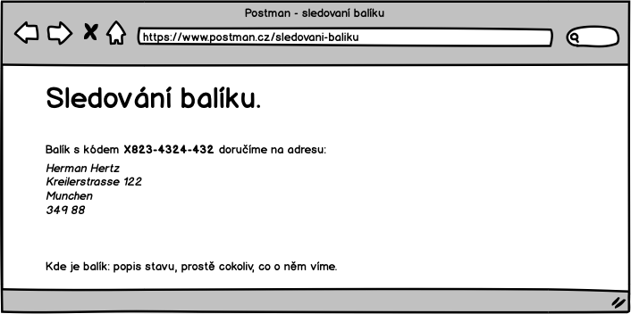

## <a name="uc-06"></a>UC-06 Sledování balíku

Zákazník bude možnost sledovat stav zásilky, co se s ní děje. 

Stránka, kde se to dozví bude vypadat násldovně:
   


Na stránku se dostave z odkazu, který bude vypadat:

```
https://postman.cz/sledovani-baliku/<kod-baliku>
```
S tím, že ``<kod-baliku>`` se nahradí skutečným kódem balíku.

Tento odkaz bude umístěn na šabloně [potvrzující objednávku](../templates/#T-01 "šablona potvrzující objednávku") a [zaplacení](../templates/#T-02 "šablona potvrzující zaplacení")

