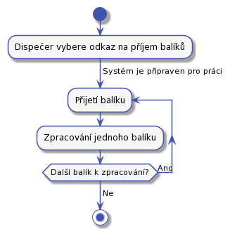
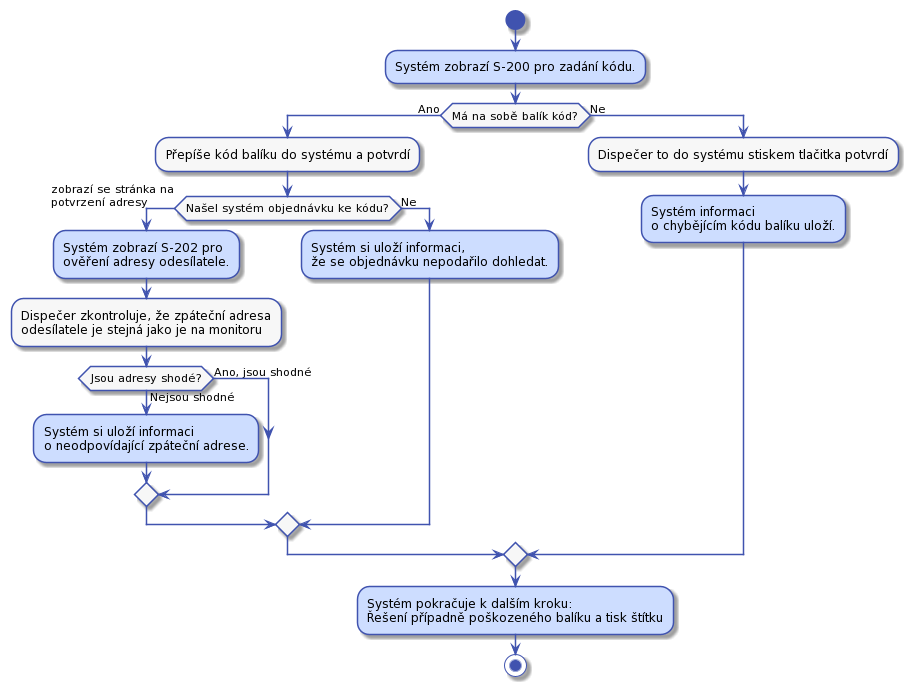

# Dispečer

Dispečer je na depu. Depo je místo, kam se doručují balíky a s něho zase vydávají dalšímu doručování. Z depa se mohou balíky vydávat přepravní společnosti, nebo se mohou vydat k doručení do dalšího depa. V aktuální verzi s posílaním do dalšího depa nepočítáme. 

Balíky jsou rozděleny do takzvaných front. To jsou místa, kde se mohou nechat do další práce s nimi. Fronty budou tyto:

* Přijímací fronta - Zde jsou balíky čekající na zpracování v UC-21.
* Čekací fronta - Zde balíky čekají, až zákazník zaplatí za přepravu.
* K doručení - Balíky z této fronty se rozdělí dopravcům.
* Chybová fronta - zde budou chybové balíky. Které napríklad nelze dohledat v systému, nemají kód nebo hrubě neodpovídají rozměrama.
* Fronty pro přepravce, napřiklad fronta pro předání DPD k finálnímu doručení adresátovi.

## UC-20 - Přijetí balíků

Dispecer přijme balíky od dopravce a dá je do přijímací fronty k dalšímu zpracování. 

Dispečer potvrdí převzetí balíku podepsáním protokolu dopravce.

## UC-21 - Zpracování přijatých balíků

Přijate balíky je třeba vložit do systému. Dispečer bude frontu balíků zpracovávat následovně: 

Zpracovaní jednoho balíku je pro srozumitelnost na samostatném obrázku:

Dispečer na balík tiskne [interní štítek](../templates/#T-06). Je třeba na balík v procesu nalepit interní štítek co nejdřív. V případě chyby to usnadní pozdější práci s balíkem a jeho sníží možnost omylu.

To jestli naměřené rozměry odpovídají zadaným zjistíme tak, že seřadíme všechny hodnoty podle velikosti a pak porovnáme s těmi hodnotami, co zadal dispečer stejně seřazenými. Jednotlivé hodnoty porovnáme tak, že pokud se budou lišit o méně než 5 cm, pak je budem považovat za shodné. Pokud se dále nebudou odlišovat o více než 10%, pak je budem považovat za shodné. Váha se bude porovnávat s tolerancí 10%.

V případě, že balík nemá na sobě kód, pak se zkontroluje adresa odesílatele a příjemce a pokud systém vyhodnotí, že to lze, vytiskne se štítek.
 

Pokud jsou adresy shodné, tak se štítek tisknou nemusí, protože odesílatel může posílat dva různé balíky jednomu adresátovi. 

**TODO Obrazovky**

## UC-22 - Zpracování balíků v 'čekací frontě'

Dispečer v systému otevře stránku pro zpracování fronty ‘čekajících balíků’ a bere po jednom začne balíky zpracovávat.

Do chybové fronty se balík přesune například, když zákazním nezaplatí déle než definovanou dobu a supportu se jestě nepodařilo se zákazníkem domluvit co s balíckem dál dělat.

Do fronty k doručení se balík přesune, v případě že zákazník zruší objednávku a budem balík budem posílat zákazníkovi zpět.

Dispečer se může kdykoliv během zpracovávání fronty rozhodnout činnost přerušit.

## UC-23 - Zpracování balíků 'k doručení'

Dispečer v systému otevře stránku pro zpracování fronty 'k doručení' a bere po jednom začne balíky zpracovávat.

Čtečkou čárových kódů načte z interního štítku kód balíčku. Systém řekne k jakému dopravci je balíček určen, tedy do jaké fronty dopravce má balíček vložit. Dispečer vloží balíček do dané fronty, potvrdí to v systému a pokračuje na další balíček.

Po vážení se aktuální váha balíku porovná s hodnotou naměřenou po nalepení interního štítku na balík. To by mělo snížit pravděpodobnost, že dojde k záměně balíků, nebo jiné chybě.

Musí existovat fronta pro Českou poštu. V případě chyby potřebujem poslat balík zpět zákazníkovy.

Dispečer se může rozhodnout, že činnost přerusí i za situace, když je fronta k doručení zpracovaná jen částečně.

## UC-24 - Zpracování balíků v 'chybové' frontě

Tady budou balíky s interním štítkem i bez něho. Dispečer balíky projde a spojí s podporou a společně se pokusí balíky identitfikovat a domluvit se na dalším postupu.

O každém chybovém balíku je záznam v systému, tedy support o každém balíku ví a může je řešit. 

## UC-25 - Předání balíků dopravci

Před tím než dispečer předá balíky z příslušné fronty dopravci, musí připravit předávací protokol. Dispečer v systému najde příslušnou frontu dopravce a stiskne na ní, že jí chce ukončit. na to mu systém vygeneruje předávací protokol, případně jeho kopii.

Když pro balíky osobně přijde dopravce, dispečer mu předá balíky a si nechá v protokolu potvrdit předání balíků.

Zde budeme muset zohlednit různé chování dopravců při předávce balíků.

**Zohlednit, pripad, ze dopravce prinesl nedorucitelne nebo odmitnute baliky.**  
