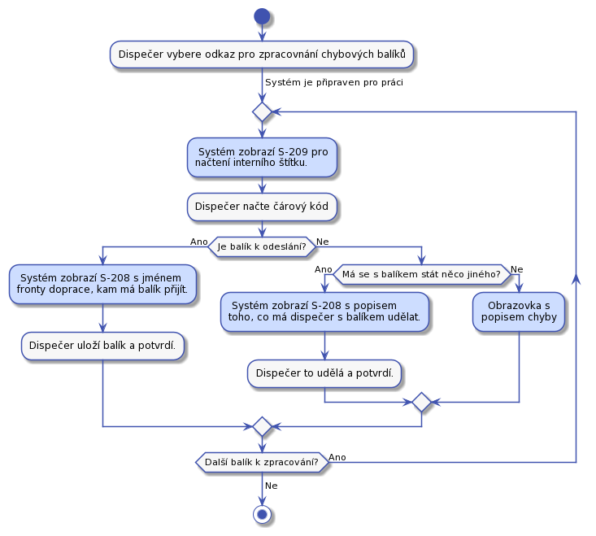

# Dispečer

Dispečer je na depu. Depo je místo, kam se doručují balíky a z něho zase vydávají dalšímu doručování. Z depa se balíky vydávají dopravci. Dopravce je doručí koncovému adresátovy, nebo se mohou doručit do dalšího depa. V aktuální verzi s posílaním do dalšího depa nepočítáme. 

Balíky jsou rozděleny do takzvaných front. Fyzicky to mohou být například regály. Fronty jsou místa, kde jsou balíky umístěny do dalšího zpracování. Fronty jsou tyto:

* Přijímací fronta - Zde jsou balíky čekající na zpracování v UC-21.
* Čekací fronta - Zde balíky čekají, až zákazník zaplatí za přepravu.
* Chybová fronta - Fronta pro chybové balíky. Které například nelze dohledat v systému, nemají kód nebo hrubě neodpovídají rozměry.
* Fronty pro dopravce - Každý dopravce bude mít svojí frontu, ze které mu budem balíky připravovat na vydání. Bude to například fronta pro DPD.

## UC-20 - Přijetí balíků

Dispečer přijme balíky od dopravce a dá je do přijímací fronty k dalšímu zpracování. Dispečer potvrdí převzetí balíku podepsáním protokolu dopravce.

## UC-21 - Zpracování přijatých balíků

Přijate balíky je třeba vložit do systému. Dispečer bude frontu balíků zpracovávat následovně: 

### Proces čtení informací z balíku

Dispečer si na [S-01 základním rozcestníku](../screens/#S-01) vybere odkaz pro zpracování přijatých balíků. Tím se mu zobrazí první stránka [S-200 pro zadání kódu balíku](../screens/#S-200). Dispečer zadá kód balíku, nebo stiskne tlačítko, že balík nemá kód. V případě, balík nemá kód se zobrazí stránka [S-201 pro zadání adresy odesílatele](../screens/#S-201). V případě, že balík má kód, systém se pokusí napojit balík na objednávku. Pokud se to nepovede systém požádá dispečera o zadání adresy odesílate [S-201](../screens/#S-201). Pokud se balík spáruje s objednávkou podle kódu balíku systém požádá o [ověření adresy odesílatele na stránce S-202](../screens/#S-202).

Pokud má balík kód odpovídající nějaké objednávce a zároveň nesedí adresa odesílatele na balíku, pak balík spojí s touto objednávkou a sytém požádá dispečera o [zadání této odlišné adresy na S-201](../screens/#S-201). Balík dál zpracujem.

Zpracovaní jednoho balíku je pro srozumitelnost na samostatném obrázku:

V tomto stavu máme všechny dostupné informace o balíku zaznamenané.

### Řešení případně poškozeného balíku a tisk štítku

Ve všech případech dispečer na balík tiskne [interní štítek](../templates/#T-06). Interní štítek musí byt nalepen tak, aby nepřekrýval informace, které na balík zadal odesílatel. Informace od odesílatele se mohou hodit pro pozdější řešení chyb.

Proces začíná na obrazovce [S-203](../screens/#S-203), kde dispečer musí rozhodnout, jestli je balík poškozen nebo ne. Jedná se o poškození obalu, nebo poškození celého balíku, které by ztížilo nebo znemožnilo další doručovaní.

Pokud balík není poškozen, pak systém zobrazí [stránku S-205 pro tisk](../screens/#S-205) [interního štítku](../templates/#T-06). Pokud je balík poškozen pak se zobrazí stránka [S-204 pro popsání míry poškození a několik fotek](../screens/#S-204). Na stránce se také dispečer musí rozhodnout, jestli lze balík přebalit a posunout dál do procesu doručení. Pokud balík nelze přebalit, pak se vytiskne interní štítek, dispečer zadá rozměry, váhu a balík putuje do chybové fronty. Pokud lze balík přebalit zobrazí se jednoduchá stránka  [S-206 pro zadání spotřeby obalového materiálu](../screens/#S-206). Pak se vytiskne interní štítek.

Pokud balík nemáme v chybové frontě, můžem jít k poslednímu kroku. V další kapitole se je rozpracovaný krok "Zpracování balíku s kódem."

### Měření, vážení a třízení balíku do front

V tomto kroku máme balík opatřený interním štítkem. Poslední krok začíná obrazovkou [S-207 pro vážení a měření](../screens/#S-207). Máme-li z předchozího procesu napárovanou objednávku na balík systém vyhodnotí jestli je balík zaplacen a k jakému dopravci má dál pokračovat a podel toho vybere frontu. Pokud nebyl balík spárován s objednávkou pak půjde do chybové fronty. Informace o další frontě bude na [obrazovce S-208](../screens/#S-208). Proces je detailně vidět z následujícího obrázku:

To jestli naměřené rozměry odpovídají těm, které zadal zákazník do objednávky zjistíme následovně. Seřadíme hodnoty ż obou skupin podle velikosti a pak navzájem porovnáme od nejmenší dvojice po nejvyšší. Tím odstraníme chybu, kdy zákazník zadá rozměry ve špatném pořadí. Jednotlivé hodnoty porovnáme tak, že pokud se budou lišit o méně než 5 cm, pak je budem považovat za shodné. Pokud se dále nebudou odlišovat o více než 10%, pak je budem považovat za shodné. Váha se bude porovnávat s tolerancí 10%.

Ve všech případech balík změříme a zvážíme. Po tom, co se dispečer dostane [obrazovku S-208](../screens/#S-208) se může rozhodnout, jestli chce pokračovat v zadávání nebo zadávání ukončit.

## UC-22 - Zpracování balíků čekajících na zaplacení

Dispečer v systému otevře stránku pro zpracování balíků čekajících na zaplacení. Pak začne zpracovávat balíky jeden po druhém v libovolném poředí.

Proces začíná na obrazovce [S-209 pro načtení interního štítku](../screens/#S-209). Pak podle toho do jaké fronty má balík přijít systém informuje dispečera [obrazovkou S-208](../screens/#S-208)

Do chybové fronty se balík přesune například, když zákazník nezaplatí déle než definovanou dobu a pracovníkovi podpory se jestě nepodařilo se zákazníkem domluvit co s balíckem dál dělat.

Dispečer se může kdykoliv během zpracovávání fronty rozhodnout činnost přerušit.

## UC-23 - Zpracování balíků ve frontě dopravce

Dispečer v systému otevře stránku pro zpracování fronty konkrétního dopravce. Pak začne zpracovávat jeden balík po druhém v libovolném pořadí takto:

Čtečkou čárových kódů načte z interního štítku kód balíčku. Systém požádá o zvážení balíku. Dispečer ho zváží. Po vážení se aktuální váha balíku porovná s hodnotou naměřenou po nalepení interního štítku na balík. To by mělo snížit pravděpodobnost, že dojde k záměně balíků, nebo jiné chybě. Pokud váha nesedí balík bude vložen do chybové fronty. Pokud váha odpovídá, systém zobrazí [stránku S-212 pro tisk štítku dopravce](../screens/#S-212).

Pokud se balík posílá po ČR použijeme Českou poštu. Proto musí v depu existovat fronta pro Českou poštu. V případě chyby potřebujeme poslat balík zpět zákazníkovy.

Dispečer se může rozhodnout, že činnost přeruší i když je fronta k doručení zpracovaná jen částečně.

## UC-24 - Zpracování balíků v 'chybové' frontě

Dispečer v systému otevře stránku pro zpracování chybové fronty. Všechny balíky bude pojednom brát a zpracovávat. V případě problému se spojí s pracovníkem podpory a společně se pokusí domluvit se na dalším postupu. Po tom co dispečer naskenuje interní štítek na [obrazovce S-209 pro načtení interního štítku](../screens/#S-209) systém vyhodnotí jestli je balík možné poslat dál, nebo má ještě počkat ve frontě. Případně pomocí [obrazovnky S-210](../screens/#S-210) lze požádat dispečera o nějakou další akci s balíkem.

O každém chybovém balíku je záznam v systému, tedy support o každém balíku ví a může je řešit.

Nelze předvídat, co vše bude třeba s chybovými balíky dělat. Pracovník podpory to může domluvit s odesílatelem a zde sdělit dispečerovi. Příklad může být, že zákazník chce poškozený balík vyhodit nebo požádal o rozdělení obsah zásilky do dvou balíků. 

## UC-25 - Předání balíků dopravci

Před tím než dispečer předá balíky z příslušné fronty dopravci, musí připravit předávací protokol. Dispečer v systému najde příslušnou frontu dopravce a stiskne na ní, že jí chce ukončit. na to mu systém vygeneruje předávací protokol, případně jeho kopii.

Když pro balíky osobně přijde dopravce, dispečer mu předá balíky a nechá si v protokolu potvrdit předání balíků.

Zde budeme muset zohlednit různé chování dopravců při předávce balíků.

## UC-26 - Příjem nedoručených balíků od dopravce

Předpokládáme, že dopravce nepřendá interní štítek z jednoho balíku na druhý. Předpokládáme, že interní štítek se může z balíku ztratit nebo se zničit.

Stejný proces jako UC-21 s tím, že balík může mít interní štítek a může být poškozen. Balíky odesíláme pouze spojené s objednávkou a zaplacené, toho lze využít k omezení hledání balíku.

To, že jsme balík už jednou předali dopraci znamená, že byl zaplacen. Tedy do čekací frnty nikdy nepůjde.

Některé kroky jsou zaznamené bez detailních obrazovek, protože jsou už popsane výše. Hledání balíku podle štítku dopravce není popsané, protože bude záviset na detailech, které budem vědět o štítku konkrétního dopravce.

Při přijímaní balíku od dopravce ve všech případech zajistíme, ze interní štítek bude nalepený a změříme a zvážíme balíček.

## UC-27 - Ztracený interní štítek

Identifikace balíku se ztraceným nebo zničeným interním štítkem. Na [hlavním rozcestníku S-01](../screens/#S-01) bude odkaz "Poškozený interní štítek". Za ním bude obrazovka na hledání balíku. Dispečer omezí hledání na fronty, nebo stavu, ve kterém balíček našel. Případně podle kódu balíčku, nebo dalších informací na balíku. Po nalezení klikne na "tisk interního štítku" a štítek se mu znovvu vytiskne. Stejně tak se zobrazí roozměry, váha a adresa odeslílatele pro kontrolu.

To, že balík nemá štítek se může stát v libovolné frontě při jakékoliv manipulaci s balíkem.

## UC-28 - Balík ve špatné frontě

Kdykoliv v nějakém UC dispečer načte interní štítek a zároveň pokud se podaří balík spojit s objednávkou, pak systém ví v jaké má být balík frontě. Systém také ví, jaký UC dispečer vykonává. Když dojde ke stavu, že balík má být v jiné frontě, pak systém zobrazí chybovou obrazovku a řekne dispečerovi, kam má balík dát. Proběhnout by to mělo takto:

Tento UC se provede, kdykoliv v jiném UC dispečer načítá interní štítek.
