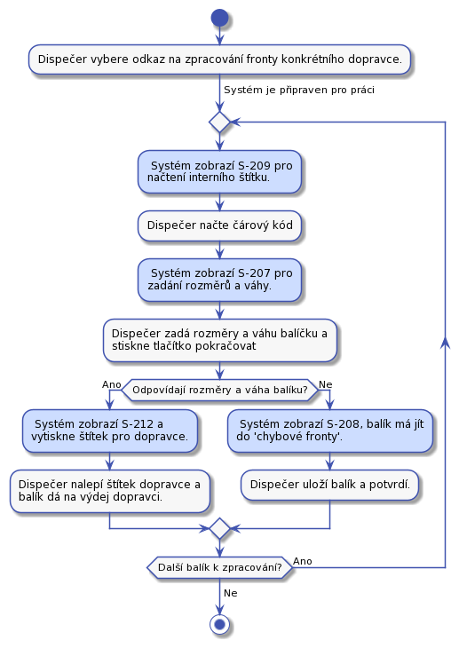

# Dispečer

**TODO Doplnit obrazovky všude**

**TODO Dokončit UC-26.**  

**TODO Dokončit UC-21. rozbite baliky**  

Dispečer je na depu. Depo je místo, kam se doručují balíky a s něho zase vydávají dalšímu doručování. Z depa se mohou balíky vydávat přepravní společnosti, nebo se mohou vydat k doručení do dalšího depa. V aktuální verzi s posílaním do dalšího depa nepočítáme. 

Balíky jsou rozděleny do takzvaných front. To jsou místa, kde jsou balíky umístěny do dalšího zpracování. Fronty budou tyto:

* Přijímací fronta - Zde jsou balíky čekající na zpracování v UC-21.
* Čekací fronta - Zde balíky čekají, až zákazník zaplatí za přepravu.
* Chybová fronta - Fronta pro chybové balíky. Které například nelze dohledat v systému, nemají kód nebo hrubě neodpovídají rozměry.
* Fronty pro dopravce - Každý dopravce bude mít svojí frontu, ze které mu budem balíky vydávat. Bude to například fronta pro předání DPD.

## UC-20 - Přijetí balíků

Dispečer přijme balíky od dopravce a dá je do přijímací fronty k dalšímu zpracování. Dispečer potvrdí převzetí balíku podepsáním protokolu dopravce.

## UC-21 - Zpracování přijatých balíků

Přijate balíky je třeba vložit do systému. Dispečer bude frontu balíků zpracovávat následovně: 

Zpracovaní jednoho balíku je pro srozumitelnost na samostatném obrázku:

Ve všech případech dispečer na balík tiskne [interní štítek](../templates/#T-06). Interní štítek musí byt nalepen tak, aby nepřekrýval informace, které na balík zadal odesílatel. Informace od odesílatele se mohou hodit pro pozdější řešení chyb.

To jestli naměřené rozměry odpovídají těm, které zadal zákazník do objednávky zjistíme následovně. Seřadíme hodnoty ż obou skupin podle velikosti a pak navzájem porovnáme od nejmenší dvojice po nejvyšší. Tím odstraníme chybu, kdy zákazník zadá rozměry ve špatném pořadí. Jednotlivé hodnoty porovnáme tak, že pokud se budou lišit o méně než 5 cm, pak je budem považovat za shodné. Pokud se dále nebudou odlišovat o více než 10%, pak je budem považovat za shodné. Váha se bude porovnávat s tolerancí 10%.

## UC-22 - Zpracování balíků v 'čekací frontě'

Dispečer v systému otevře stránku pro zpracování fronty ‘čekajících balíků’. Pak začne zpracovávat balíky jeden po druhém v libovolném poředí.

Do chybové fronty se balík přesune například, když zákazním nezaplatí déle než definovanou dobu a pracovníkovi podpory se jestě nepodařilo se zákazníkem domluvit co s balíckem dál dělat.

Dispečer se může kdykoliv během zpracovávání fronty rozhodnout činnost přerušit.

## UC-23 - Zpracování balíků ve frontě dopravce

Dispečer v systému otevře stránku pro zpracování fronty konkrétního dopravce. Pak začne zpracovávat jeden balík po druhém v libovolném pořadí takto:

Čtečkou čárových kódů načte z interního štítku kód balíčku. Systém požádá o zvážení balíku. Dispečer ho zváží. Po vážení se aktuální váha balíku porovná s hodnotou naměřenou po nalepení interního štítku na balík. To by mělo snížit pravděpodobnost, že dojde k záměně balíků, nebo jiné chybě. Pokud váha nesedí balík bude vložen do chybové fronty.

Musí existovat fronta pro Českou poštu. V případě chyby potřebujem poslat balík zpět zákazníkovy.

Dispečer se může rozhodnout, že činnost přeruší i když je fronta k doručení zpracovaná jen částečně.

## UC-24 - Zpracování balíků v 'chybové' frontě

Všechny balíky v této frontě budou mít interní štítek. Dispečer všechny balíky projde. V případě problému se spojí s pracovníkem podpory a společně se pokusí domluvit se na dalším postupu.

O každém chybovém balíku je záznam v systému, tedy support o každém balíku ví a může je řešit. 

## UC-25 - Předání balíků dopravci

Před tím než dispečer předá balíky z příslušné fronty dopravci, musí připravit předávací protokol. Dispečer v systému najde příslušnou frontu dopravce a stiskne na ní, že jí chce ukončit. na to mu systém vygeneruje předávací protokol, případně jeho kopii.

Když pro balíky osobně přijde dopravce, dispečer mu předá balíky a nechá si v protokolu potvrdit předání balíků.

Zde budeme muset zohlednit různé chování dopravců při předávce balíků.

## UC-26 - Příjem nedoručených balíků od dopravce

Stejný proces jako UC-21 s tím, že balík může mít interní štítek a může být poškozen.

