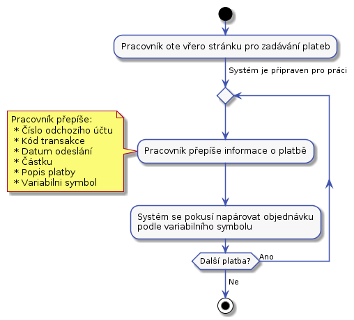

# Podpora

Nechem delat dobropisy, radeji volat.
z chybbove fronty musime obvolavat.  3 krat zadat o zaplaceni + tyden cekani na platbu.
Z fronty ceka na zaplaceni.

## UC-31 - Změna/obnova hesla

Uživatel zavolá nebo napíše na podporu. Pracovník podpory oveří jeho odentitu zavoláním zpět a pokud sedí, pak změní heslo, keré sdělí zákazníkovi nebo pošle emailem.

**Toto je poměrně nebezpečné, ale jednoduché.** 

## UC-32 - Zapomenuté přihlašovací jméno

Uživatel zavolá nebo napíše na podporu. Pracovník podpory dohledá přihlašovací jméno, například pdle jména uživatele a sdělí je uživateli. 

**Toto je poměrně nebezpečné, ale jednoduché.** 

## UC-33 - Kontrola bankovního účtu

Pracovník podpory otevře na jedné straně bankovnictví a v našem systému obrazovku [S-06 platby](../screens/#S-06). Z bankovního sytému začne přepisovat zaplacené částky do našeho systému.

Samotná platba se bude vkládat pomocí [obrazovky S-07 pro vložení platby](../screens/#S-07)
Při zadáváne nebudem párovat zaplacené částky s objednávkama. Pouze přepíšem příchozí platby. To umožní řešit chyby jako je částečná platba za objednávku. Pokud tato činnost zůstane samostatná půjde jí později snadno automatizovat.

Kód transakce z bankovnictví potřebujem, protože to je unikátní identifikátor platby. Ten nám pomůže jako obrana, před opakovaným vložením jedné platby.

Při zadávání příchozí platby se systém podívá, jestli existuje nezaplacená objednávka, kde variabilní symbol odpovídá číslu objednávky. Pokud odpovídá, pak rovnou spojí platbu s objednávkou. Platbu s objednávkou spojíme i v následujícich případech:

* Výše platby nesouhlasí s částkou na objednávce a to jak nahoru, tak dolu.
* Platba se páruje na objednávku v libovolném stavu.
* Platba se páruje s objednávkou, která má balíky v libovolném stavu.

Pokud bude více příchozích účtů, pak každý bude mít svojí vlastní stránku na zadávání.

## UC-34 - Párování plateb
Spárování plateb s chybným nebo zcela chybějícím variabilním symbolem na objednávky.

S systému bude odkaz na párování plateb. Párování plateb se zapne tlačitkem. Po spárování se ukáže seznam chybových událostí. Variabiln symbol je číslo objednávky.

### Z příchozího účtu nám již v historii přišla platba na jinou objednávku
Pracovník otevře stránku [S-06 s platbama](../screens/#S-06) a zašktrne, že chce zobrazit pouze nespárované platby. Pak se pracovník pokusí dohledat objednávku. Například může dohledat, jestli uz historicky z daného účtu nějaké platby přišli. Pomocí obrazovky [S-08 získat seznam plateb vyfiltrovaný podle odchozího účtu](../screens/#S-08). V seznamu najít již napárovanou objednávku. U napárované objednávky se podívat na detaily a v nich na odesílatele. Dál se pokusit podle odesílatele dohledat nezaplacené objednávky. Pokud taková existuje a odpovídá výše platby, pak lze platbu s objednávkou spárovat pomocí obrazovky [S-09 spárovat účet](../screens/#S-09).

### Z příchozího účtu nám již v historii nikdy nepřišla platba 
Pracovník se pokusí dohledat nezaplacenou objednávku ve výši příchozí platby. Na to použije obrazovku [S-10 pro vyhledání objednávek podle jejich výše](../screens/#S-10).	 Pak použije obrazovku [S-11 pro spárování objednávky a účtu](./screens/#S-11)

### Ostatní případy
Zde již nebudem schopni jednoduše dohledat objednávku. Bude potřeba jít do nezaplacených objednávek a nějakou lhůtu nezaplacené objednávky obvolat, jestli už náhodou nezaplatili.

Některé z chyb půjde později dobře řešit automatizací. V tuto chvíli umožníme pracovníkovi podpory pouze ruční řešení.

## UC-35 - Řešení chybové fronty

Balíky v chybové frontě jsou neuspořádané. Některé mají nalepný interní kód některé ne. O každém balíku v chybové frontě je v systému záznam. Zde se pracovník podpory bude snažit najít pro balíky nějaké řešení. Řešení něktrých druhů chyb:

* Chybějící odresa odesílatele.
    * Pracovník podpory se pokusí podle čísla účtu platby dohledat jiné objednávky a podle nich doplnit účet.
* V ostatních případech pracovník podpory zavolá zákazníkovy a společně se domluví na řešení. O dohodě uloží záznam do historie k objednávce.

Po tom, co se podaří na řešení co s balíkem domluvit se zákazníkem pracovník podpory se spojí s dispečerem a balík z chybové fronty pošlou dál.

**Reseni baliku po telefonu je hodne divne, ale nevim, jak vyreseit, ze neketer baliky nemaji interni stitek. tady by pomohlo, kdyby kazdy balik, co prijmem dostal interni stitek.**

**Detailní řešení jednotlivých chyb těď nebudem řešit.**
 
## UC-36 - Storno objednávky

Zákazník může napsat nebo zavolat a pokusit se zrušit objednávku. V tomto případě pracovník podpory vyhledá objednávku v systému a pokud to je možné, tak provede storno objednávky. Balík se vrátí na  adresu odesilatele. Po stisku storna objednávky se automaticky pošle [T-04 dobropis](../templates/#T-04) na emailovou adresu odesilatele. Pracovník podpory pak musí jít a ručně poslat zákazníkovi příslušný obnos. Objednávku lze zrušit pokud balík není na cestě k adresátovi.

## UC-37 - Urgence zaplacení

* **Nabízí se, aby systém automaticky generoval upomínky k zaplacení. Z časových důvodů navrhuji implementovat později.** 
* **Neřešíme urgenci zaplacení objednávek, ke kterým nedorazili balíky**

Pracovník podpory otevře část pro zobrazení fronty balíků čekajících pro zaplacení. Zobrazí se stránka se seznamem balíků. Klikne na zobrazení detailů objednávky, záložku s komunikační historiíí, zkontroluje poznámky, jestli tam není už jiný problém. Podle úvahy pošle email nebo zákazníkovi zavolá. O tom, co udělal pořídí záznam do komunikační hstorie.

## UC-38 - Řešení přeplacených objednávek

## UC-39 - Zobrazení detailů objednávky a balíku

## UC-40 - Vystaveni dobropisu

na základě emailu nebo telefonátu.

## UC-41 - TBD

## UC-42 - Reklamace

oncall/email. musime se napojit na last mile prepravce informace o zasilce.

**Budem to vubec resit?**

