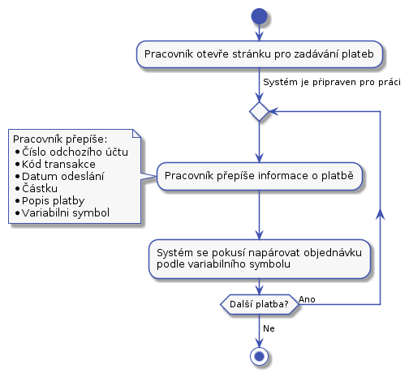

# Podpora - práce s objednávkou a balíkem

**TODO - Finance dat do zamostatne sekvence 400, baliky 500 ...**

**TODO - Obecne pridat informace auditniho logu k dotcenym UC.**

**TODO - Asi bychom meli mit moznost zakaznikovy z objednavky poslat dodatecnou fakturu, napriklad  za likvidaci baliku, slozite prebalovani, .... Plyne z toho, ze zakaznika, potrebujem evidovat jako samostatnou entitu? Asi ano.**

**TODO UC-44 jak zaznamenat, že zákazník chce vrátit balík?**

**TODO UC-44 jak zaznamenat, že zákazník chce zlikvidovat balík?**

**TODO - toto asi smazat - Když přijde platba, která nemá variabilní symbol, tak pracovník zkusí vyhledat jiné platby z účtu odesílatele platby. Pokud se nějaké najdou, tak se u těchto plateb pracovník podívá na zákazníka. Protože zákazníky neunifikujem budeme mít pro kažnou objednávku jednoho zákazníka. Mezi nimi bude třeba hledat fulltextem. To je krok navíc a může to přinést chyby (kdy pracovník podpory ztotožní plátce se špatnou objednávkou). Toto riziko lze zmenšit tím, že se snažíme objednávky napojit na entitu zákazníka. To může přinést další obtíže a pracnost.**

**TODO - nevadí to? - Návrh neřeší situaci, kdy zákazník pošle platbu na objednávku, kterou už máme uzavřenou. Máme na to myslet?**

**TODO - muze pracovnik podpory pri vystaveni dobropisu upravit castku? Napriklad cast penez u nas zadrzet. Treba za dopravu.**

**TODO - je povinnost posilat dobropis, v pripade, ze zakaznik zrusi objenavku, ale jeste neposlal penize.**

**TODO - Zahrnout pripad, kdy zakaznik zrusi objednavku, ale mi nevime, ze poslal penize, protoze jsou na ceste.**

Každý balík má svůj kód. Kod je nezávislí na objednávce. Kód balíku je to, co zádáme zákaníka, aby napsal na balík. Pokud bude v objednávce víc balíků, pak každý balík bude mít svůj kůd.

## UC-40 - Kontrola bankovního účtu

Pracovník podpory otevře na jedné straně bankovnictví a v našem systému obrazovku [S-06 přehled plateb](../screens/#S-06). Z bankovního sytému začne přepisovat zaplacené částky do našeho systému.

Samotná platba se bude vkládat pomocí [obrazovky S-07 pro vložení platby](../screens/#S-07)
Tento UC by měl zůstat samostatný, protože ho půjde snadno automatizovat.

Kód transakce z bankovnictví potřebujem, protože to je unikátní identifikátor platby. Ten nám pomůže jako obrana, před opakovaným vložením jedné platby.

Při zadávání příchozí platby se systém podívá, jestli existuje nezaplacená objednávka, kde variabilní symbol odpovídá číslu objednávky. Pokud odpovídá, pak rovnou spojí platbu s objednávkou. Platbu s objednávkou spojíme i v následujícich případech:

* Výše platby nesouhlasí s částkou na objednávce a to jak nahoru, tak dolu.
* Platba se páruje na objednávku v libovolném stavu.
* Platba se páruje s objednávkou, která má balíky v libovolném stavu.

Pokud bude více příchozích účtů, pak každý bude mít svojí vlastní stránku na zadávání.

## UC-41 - Párování plateb
Párování plateb s chybným nebo zcela chybějícím variabilním symbolem na objednávky.

S systému bude odkaz na párování plateb. Párování plateb se zapne tlačitkem. Po spárování se ukáže seznam chybových událostí. Variabiln symbol je číslo objednávky.

Pracovník z hlavní stránky otevře stránku [S-06 s přehledem plateb](../screens/#S-06) a zaškrtne, že chce zobrazit pouze nespárované platby. Pak se pracovník pokusí k jednotlivým platbám dohledat objednávky. Může využít jeden z následujících postupů:

### Z příchozího účtu nám v minulosti přišla platba na jinou objednávku
Například může zkusit dohledat, jestli uz v minulosti z daného účtu nějaké platby přišli. Pomocí obrazovky [S-08 získat seznam plateb vyfiltrovaný podle odchozího účtu](../screens/#S-08). Pokud je v nalezených platbách aspoň jedna s napárovanou objednávkou, tak se může u napárované objednávky podívat na detaily a najít detaily zákazníka. Pak na stránce [S-10 na hledání objednávek](../screens/#S-10) zvolí, že chce pouze nezaplacené objednávky a zkusí objednávku vyhledat. Pokud taková existuje a odpovídá výše platby, pak lze platbu s objednávkou spárovat. Na stránce s hledáním objednávek u konkrétní objenávky zvolí "Spárovat". Tím se pracovníkovi zobrazí obrazovka [S-11 pro párování platby](../screens/#S-11).

### Z příchozího účtu nám nikdy nepřišla platba 
Pracovník se pokusí dohledat nezaplacenou objednávku, která je na částku ve výši nespárované příchozí platby. Na to použije obrazovku [S-10 pro vyhledání objednávek](../screens/#S-10), na ní omezí hledání objednávek jen na určitou výši, případně omezí výsledky na nezaplacené objednávky. Pak použije obrazovku [S-11 pro spárování objednávky a účtu](./screens/#S-11).

### Kontrola dalších polí u platby

Pracovník podpory by měl ověřit, že informace důležité pro spárovaní nejsou v poli poznámka pro příjemce. Nebo může pomoct pole jméno účtu. V některé banky toto pole používají pro jméno plátce.

### Ostatní případy
Pokud předchozí kroky neposkytli možnost spárovat platbu s účtem, tak pracovník může zkusit obvolat nezaplacené objednávky. Zde bude třeba nastavit nějou rozumnou lhůtu od zadání objednávky. Pokud někdo zadal obednávku včera 	je možné, že platba je na cestě. Podobný případ budou nezaplacené objednávky starší než nekolik měsíců.

Některé z uvedených postupů půjde později dobře řešit automatizací. V tuto chvíli umožníme pracovníkovi podpory pouze ruční řešení.

## UC-42 - Odpárování platby

Pokud pracovník podpory na detailu objednávky na obrazovce [S-04](../screens/#S-04) stiskne u konkrétní platby "Odpárovat", tak se zobrazí potvrzovací dialog [S-041](../screens/#S-041). Pokud pracovník potvrdí odpárování, pak se platba odpáruje. Pracovník se vrací na stránku [S-04](../screens/#S-04) 

## UC-44 - Urgence zaplacení

V tomto návrhu neřešíme urgenci zaplacení objednávek, ke kterým nedorazili balíky. Je to z důvodu optimalizace nákladů na kontakt se zákazníkem.

Nabízí se, aby systém automaticky generoval několik upomínek k zaplacení sám. Teprve poté žádal pracovníka podpory, co dál. V této verzi nebudem implementovat.

Pracovník podpory otevře stránku [S-10 pro hledání objednávek](../screens/#S-10). Zde hledání omezí následovně:

* Zaškrtne pole "Vybrat pouze objednávky, kde platba ...". Do následujícího pole napíše 10.
* Zaškrtne pole "Vybrat objednávky, ke kterým dorazil aspoň jeden balík".
* V poli stav objenávky vybere hodnotu "Nezaplacená".
* Stiskne tlačítko "Hledat"

Tím se mu zobrazí více než 10 dní nezaplacené objednávky, ke kterým dorazil balík. Pracovník podpory bude po jedné procházet nalezené objednávky. Po kliknutí na kód objednávky se zobrazí stránka [S-04 s detaily objednávky](../screens/#S-04). Zde se podívá do komunikační historie se zákazníkem. Pak podle úvahy nebo připraveného scénáře osloví zákazníka a domluví s ním řešení nezaplacené služby.

Toto řešení je jednoduché na výrobu, ale při větším množství nezaplacených balíků bude příliš pracné a nepřehledné. U vyhledaných objednávek nebude na první pohled zřejmé, v jakém stavu je komunkace. Toto se obvykle řeší samostatným procesem.

## UC-45 - Řešení přeplacených objednávek

**TODO**

## UC-45 - Řešení zaplacených objednávek, ke ketrým nedorazil balík

**TODO**
 
## UC-43 - Storno objednávky

Zákazník může napsat nebo zavolat a pokusit se zrušit objednávku. V tomto případě pracovník podpory vyhledá objednávku v systému a pokud to je možné, tak provede storno objednávky. Balík se vrátí na  adresu odesilatele. Po stisku storna objednávky se automaticky pošle [T-04 dobropis](../templates/#T-04) na emailovou adresu odesilatele. Pracovník podpory pak musí jít a ručně poslat zákazníkovi příslušný obnos. Objednávku lze zrušit pokud balík není na cestě k adresátovi.

## UC-47 - Vystaveni dobropisu

V něktrých případech bude pořeba zákazníkovi "vrátit" peníze, které nám předtím poslal. Například, pokud se zákazník rozhodne od slouvy odstoupit. V těchto případech mu musíme vystavit dobropis provézt platbu zpět. Pracovník podpory vyhledá objednávky a zobrazí si [S-04 její detail](..screens/#S-04). Pak stiskne tlačítko vystavit dobropis.

## UC-49 - Reklamace

## UC-50 - Řešení chybové fronty

Balíky v chybové frontě jsou neuspořádané. Některé mají nalepný interní kód některé ne. O každém balíku v chybové frontě je v systému záznam. Zde se pracovník podpory bude snažit najít pro balíky nějaké řešení. Řešení něktrých druhů chyb:

* Chybějící odresa odesílatele.
    * Pracovník podpory se pokusí podle čísla účtu platby dohledat jiné objednávky a podle nich doplnit účet.
* V ostatních případech pracovník podpory zavolá zákazníkovy a společně se domluví na řešení. O dohodě uloží záznam do historie k objednávce.

Po tom, co se podaří na řešení co s balíkem domluvit se zákazníkem pracovník podpory se spojí s dispečerem a balík z chybové fronty pošlou dál.

**Reseni baliku po telefonu je hodne divne, ale nevim, jak vyreseit, ze neketer baliky nemaji interni stitek. tady by pomohlo, kdyby kazdy balik, co prijmem dostal interni stitek.**

**Detailní řešení jednotlivých chyb těď nebudem řešit.**

## UC-50 - Řešení poškozeného balíku

## UC-46 - Řešení naspárovaného balíku

na základě emailu nebo telefonátu.

## UC-48 - TBD

oncall/email. musime se napojit na last mile prepravce informace o zasilce.

**Budem to vubec resit?**

