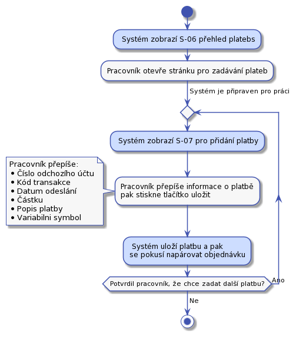

# Podpora - práce s platbou a daňovým dokladem
Hledání v [UC-405](../uc-40/#UC-405) a [UC-409](../uc-40/#UC-409) je specifické. Při implementaci zvažme, jestli to nemají být samostatné stránky bez formuláře na hledání. Pouze dvě stránky s výpisy.

Každý balík má svůj kód. Kod je nezávislí na objednávce. Kód balíku je to, co zádáme zákaníka, aby napsal na balík. Pokud bude v objednávce víc balíků, pak každý balík bude mít svůj kůd.

## UC-400 - Kontrola bankovního účtu

Pracovník podpory otevře na jedné straně bankovnictví a v našem systému obrazovku [S-06 přehled plateb](../screens/#S-06). Z bankovního sytému začne přepisovat zaplacené částky do našeho systému.

Samotná platba se bude vkládat pomocí [obrazovky S-07 pro vložení platby](../screens/#S-07)
Tento UC by měl zůstat samostatný, protože ho půjde snadno automatizovat.

Kód transakce z bankovnictví potřebujem, protože to je unikátní identifikátor platby. Ten nám pomůže jako obrana, před opakovaným vložením jedné platby.

Při zadávání příchozí platby se systém podívá, jestli existuje nezaplacená objednávka, kde variabilní symbol odpovídá číslu objednávky. Pokud odpovídá, pak rovnou spojí platbu s objednávkou. Platbu s objednávkou spojíme i v následujícich případech:

* Výše platby nesouhlasí s částkou na objednávce a to jak nahoru, tak dolu.
* Platba se páruje na objednávku v libovolném stavu.
* Platba se páruje s objednávkou, která má balíky v libovolném stavu.

Pokud bude více příchozích účtů, pak každý bude mít svojí vlastní stránku na zadávání.

## UC-401 - Párování plateb
Párování plateb s chybným nebo zcela chybějícím variabilním symbolem na objednávky.

S systému bude odkaz na párování plateb. Párování plateb se zapne tlačitkem. Po spárování se ukáže seznam chybových událostí. Variabiln symbol je číslo objednávky.

Pracovník z hlavní stránky otevře stránku [S-06 s přehledem plateb](../screens/#S-06) a zaškrtne, že chce zobrazit pouze nespárované platby. Pak se pracovník pokusí k jednotlivým platbám dohledat objednávky. Může využít jeden z následujících postupů:

### Z příchozího účtu nám v minulosti přišla platba na jinou objednávku
Například může zkusit dohledat, jestli uz v minulosti z daného účtu nějaké platby přišli. Pomocí obrazovky [S-08 získat seznam plateb vyfiltrovaný podle odchozího účtu](../screens/#S-08). Pokud je v nalezených platbách aspoň jedna s napárovanou objednávkou, tak se může u napárované objednávky podívat na detaily a najít detaily zákazníka. Pak na stránce [S-10 na hledání objednávek](../screens/#S-10) zvolí, že chce pouze nezaplacené objednávky a zkusí objednávku vyhledat. Pokud taková existuje a odpovídá výše platby, pak lze platbu s objednávkou spárovat. Na stránce s hledáním objednávek u konkrétní objenávky zvolí "Spárovat". Tím se pracovníkovi zobrazí obrazovka [S-11 pro párování platby](../screens/#S-11).

### Z příchozího účtu nám nikdy nepřišla platba 
Pracovník se pokusí dohledat nezaplacenou objednávku, která je na částku ve výši nespárované příchozí platby. Na to použije obrazovku [S-10 pro vyhledání objednávek](../screens/#S-10), na ní omezí hledání objednávek jen na určitou výši, případně omezí výsledky na nezaplacené objednávky. Pak použije obrazovku [S-11 pro spárování objednávky a účtu](./screens/#S-11).

### Kontrola dalších polí u platby

Pracovník podpory by měl ověřit, že informace důležité pro spárovaní nejsou v poli poznámka pro příjemce. Nebo může pomoct pole jméno účtu. V některé banky toto pole používají pro jméno plátce.

### Ostatní případy
Pokud předchozí kroky neposkytli možnost spárovat platbu s účtem, tak pracovník může zkusit obvolat nezaplacené objednávky. Zde bude třeba nastavit nějou rozumnou lhůtu od zadání objednávky. Pokud někdo zadal obednávku včera 	je možné, že platba je na cestě. Podobný případ budou nezaplacené objednávky starší než nekolik měsíců.

Některé z uvedených postupů půjde později dobře řešit automatizací. V tuto chvíli umožníme pracovníkovi podpory pouze ruční řešení.

## UC-402 - Odpárování platby

Pokud pracovník podpory na detailu objednávky na obrazovce [S-04](../screens/#S-04) stiskne u konkrétní platby "Odpárovat", tak se zobrazí potvrzovací dialog [S-041](../screens/#S-041). Pokud pracovník potvrdí odpárování, pak se platba odpáruje. Pracovník se vrací na stránku [S-04](../screens/#S-04) 

## UC-403 - Urgence zaplacení

V tomto návrhu neřešíme urgenci zaplacení objednávek, ke kterým nedorazili balíky. Je to z důvodu optimalizace nákladů na kontakt se zákazníkem.

Nabízí se, aby systém automaticky generoval několik upomínek k zaplacení sám. Teprve poté žádal pracovníka podpory, co dál. V této verzi nebudem implementovat.

Pracovník podpory otevře stránku [S-10 pro hledání objednávek](../screens/#S-10). Zde hledání omezí následovně:

* Zaškrtne pole "Vybrat pouze objednávky, kde platba ...". Do následujícího pole napíše 10.
* Zaškrtne pole "Vybrat objednávky, ke kterým dorazil aspoň jeden balík".
* V poli stav objenávky vybere hodnotu "Nezaplacená".
* Stiskne tlačítko "Hledat"

Tím se mu zobrazí více než 10 dní nezaplacené objednávky, ke kterým dorazil balík. Pracovník podpory bude po jedné procházet nalezené objednávky. Po kliknutí na kód objednávky se zobrazí stránka [S-04 s detaily objednávky](../screens/#S-04). Zde se podívá do poznámek objednávky, kde je popsána komunikace se zákazníkem. Pak podle úvahy nebo připraveného scénáře osloví zákazníka a domluví s ním řešení nezaplacené služby.

Toto řešení je jednoduché na výrobu, ale při větším množství nezaplacených balíků bude příliš pracné a nepřehledné. U vyhledaných objednávek nebude na první pohled zřejmé, v jakém stavu je komunikace. Toto se obvykle řeší samostatným procesem.

## UC-404 - Řešení přeplacených objednávek

Pracovník potřebuje vyhledat: 

* Objednávky, ke kterým přišla platba ve zvoleném období.
* Platba přišla po tom, co byla objednávka naposledy posunuta do stavu "Doručovaná". Tedy jsme už žádnou platbu nečekali.

Pracovník si z hlavní obrazovky otevře stránku [S-011 hledání objednávky podle platby](../screens/#S-011). Zde vybere potřebná omezení a stiskne "Hledat". Případné nalezené objednávky musí pracovník podpory jednu po druhé otevírat a domluvou se zákazníkem řešit dál. Například vystavením dobropisu.

Protože budou v systému zadané i odchozí platby na účet zákazníka pracovník ze uvidí i stav, kdy odeslal zákazníkovi platbu zpět po tom, co byla objednávka zaplacená.

## UC-405 - Řešení zaplacených objednávek, ke kterým nedorazil balík
Pracovník podpory bude postupovat následovně:

1. Z hlavního rozcestníku otevře [S-10 stránku pro hledání objednávek](../screens/#S-10). 
1. Zde ověří, že je odšktnuté pole "Vybrat objednávky, ke kterým dorazil aspoň jeden balík."
1. Zašktne pole "Vybrat objednávky, ke kterým nedorazil žádný balík".
1. Nastaví stav hledaných objednávek na `Doručovaná`.
1. Stiskne "vyhledat".
1. Pro každou nalezenou objednávku:
    2. Pracovník otevře [detail objednávky S-04](../screens/#S-04).
    2. Zkontroluje poznámky k objednávce. Pokud zde není záznám o tom, že jsme zákazníka v této věci kontaktovali, pak napíše email s dotazem, jak má postupovat. Pokud už nějaká komunikace proběhla, pak musí postupovat podle úvahy.
1. Hotovo.

## UC-406 - Vystavení dobropisu

V některých případech bude potřeba zákazníkovi "vrátit" peníze, které nám předtím poslal. Například, pokud se zákazník rozhodne od slouvy odstoupit musíme vystavit dobropis a provézt platbu zpět. To pracovní podpory provede následovně:

1. Pracovník podpory vyhledá objednávku a zobrazí si [její detail S-04](../screens/#S-04).
1. Stiskne tlačítko "vystavit dobropis" a zobrazí se mu stránka [S-045 pro vystavení dobropisu](../screens/#S-045).
1. Po vyplnění částky, a potvrzení formuláře se podle šablony [T-04](../templates/#T-04) vytvoří dobropis a uloží mezi daňové dokumenty objednávky. Zároveň se opět zobrazí stránka s detailem objednávky [S-04](../screens/#S-04), kde už bude dobropis připravený ke stažení. Dobropis se automaticky zákazníkovi neodesílá.
1. Pracovník napíše napíše průvodní email, stáhne dobropis přiloží ho k emailu. Email odešle.
1. Poté půjde do internetového bankovnictví a peníze pošle zákazníkovi. 
1. Nakonec všem připraví záznam do poznámek objednávky [UC-58](../uc-50/#UC-58).

## UC-407 - Vystavení upravené faktury
V některých případech bude potřeba zákazníkovy vystavit novou fakturu na jinou částku než je uvedeno v objednávce a za jiné služby než je uvedeno v objednávce nebo s jinými dalšími informacemi. Například za likvidaci balíku. Nebo zákazník bude žádat opravu nějakého údaje na faktuře.

Vystavení upravené faktury provede pracovník podpory následovně:

1. Najde [detail objednávky S-04](../screens/#S-04), ke které bude vytvářed fakturu.
1. Stiskne tlačítko "Vystavit fakturu" a dostane se na stránku [S-046 pro vystavení faktury](../screens/#S-046).
1. Na faktuře upraví všechny potřebné informace.
1. Stiskne tlačítko "vystavit fakturu". Po stisku tlačítka se vygenruje PDF faktura a pracovník se vrátí zpět na [detail objednávky S-04](../screens/#S-04). Faktura se automaticky zákazníkovi neodesílá. Pouze se zobrazí v sekci daňových dokladů. 
1. Pracovník připraví průvodní email, fakturu k němu přiloží a email odešle.
1. Pokud je to potřeba, pracovník posune objednávku do stavu "Nezaplacená", aby šlo sledovat její pozdější zaplacení.
1. O všem připraví záznam do kontaktní historie [UC-58](../uc-50/#UC-58).

Tím je faktura vystavená.

## UC-408 - Úprava objednávky
Nebude možné upravit pole adresáta, zde je uvedeno to, co zadal zákazník na objednávce. Skutečně se doručuje na adresy na balíkách v této objednávce. Lze upravit následující pole:

* Adresu odesílatele
* Kontaktní telefon zákazníka
* Kontaktní email zákazníka
* Jméno a příjmení
* Variabilní symbol

Předpoklady:

* Pracovník podpory má zobrazený [detail objednávky S-04](../screens/#S-04), kterou chce upravit.

Úpravu provede pracovník následovně:

1. Stiskne tlačítko "Upravit objednávku" a dostane se na stránku pro úpravu detailů objednávky.
1. Na detailu objednávky upraví všechny potřebné informace.
1. Stiskne tlačítko "Uložit".
1. Po stisku tlačítka se zobrazí upravený [detail objednávky S-04](../screens/#S-04).
1. Hotovo.

## UC-409 - Řešení nezaplacených objednávek, ke kterým nedorazil balík
Všechny nezaplacené objednávky, ke kterým daný počet dní nedorazil balík budou zrušeny. Pracovník podpory bude postupovat následovně:

1. Z hlavního rozcestníku otevře [S-10 stránku pro hledání objednávek](../screens/#S-10). 
1. Nastaví stav hledaných objednávek na `Nezaplacená`.
1. Do pole "Vybrat pouze objednávky, kde platba nepřišla X dní." zadá 30.
1. Zde ověří, že je odšktnuté pole "Vybrat objednávky, ke kterým dorazil aspoň jeden balík."
1. Zašktne pole "Vybrat objednávky, ke kterým nedorazil žádný balík".
1. Stiskne "vyhledat".
1. Pro každou nalezenou objednávku:
    2. Pracovník otevře [detail objednávky S-04](../screens/#S-04).
    2. Stiskne tlačítko "Storno".
1. Hotovo.

## UC-410 - Rozdělení platby mezi dvě objednávky.
Předpoklady:

* Pracovník podpory má zobrazený [detail objednávky S-04](../screens/#S-04).
* V seznamu plateb je jedna, která má být rozdělena mezi dvě objednávky.

Kroky:

1. Pracovník u vybrané platby klikne na "Rozdělit".
1. Zobrazí se obrazovka [pro rozdělení platby mezi dvě objednávky S-048](../screens/#S-048).
1. Pracovník zadá číslo objednávky a zvolí částku, která se z původně zobrazené objednávky odebere a přidá se k zadané objednávce.
1. Pracovník stiskne tlačítko "Rozdělit platbu".
1. Systém zobrazí původní objednávku, kde už bude platba ponížená o zvolenou částku.

